# TranscriptionSync: Phoneme-Aware Real-Time Lip Synchronization for Native-Audio Large Language Models, Deployed in A.T.L.A.S — a Fully Implemented Embodied Desktop Assistant

**Asst. Prof. Dr. Murat ARSLAN**¹

¹ Department of Software Engineering, Altınbaş Cyprus University, Cyprus

Corresponding author: Murat Arslan (e-mail: research@wpu.edu.tr).

---

## ABSTRACT

Native-audio (speech-to-speech) large language models collapse the recognition/generation/synthesis cascade into a single model with near-human turn-taking latency, but emit raw PCM with no phoneme timing — invalidating the established lip-sync toolchain: phoneme- and alignment-driven pipelines are non-causal, and learned audio-driven animation needs GPU budgets unavailable on consumer desktops. We formalize causal, phoneme-timing-free, CPU-budget lip synchronization and present **TranscriptionSync**, a training-free three-layer solution. Layer 1 recovers word timing from the output audio with a streaming recognizer; a *playout-buffer model* converts its latency into a bounded, tunable response delay rather than desynchronization. Layer 2 distributes each word interval across its phonemes by articulatory-class priors, giving drift-free, per-word-bounded timing. Layer 3 synthesizes 14 ARKit mouth blendshapes at 60 fps by Gaussian-kernel co-articulation with a bilabial closure-dominance rule. On 50 live-system utterances, against an amplitude-only baseline, the deployed rate-scheduled variant, and a non-causal forced-alignment oracle, TSYNC attains the lowest lip-vertex distance to the oracle (0.461 vs. 0.520/0.556, Holm-corrected Wilcoxon p < 10⁻⁶), with co-articulation, not duration estimation, the driver; SyncNet LSE-C/LSE-D do not corroborate this, and a data-driven check finds them invalid on the untextured avatar — which we report rather than omit. Layers 2–3 cost under 0.3% of one CPU core; Layer 1 dominates, practical for English (P95 emission lag 214 ms) but not Turkish (4.9 s) at the smallest model. On 6 000 GRID utterances Layer 2 reaches 18 ms phoneme-midpoint accuracy (below the ±45 ms detectability bound), composed accuracy is recognizer-bounded at 65 ms, and live word-start timing (86 ms) transfers from corpus to deployment. Since our one perceptual metric proved invalid here, the quality claim is geometric (LVD), pending a user study. The method ships inside A.T.L.A.S, a complete embodied desktop assistant on Gemini 2.5 Flash Native Audio.

**INDEX TERMS** — ARKit blendshapes, embodied conversational agents, grapheme-to-phoneme conversion, large language models, lip synchronization, multimodal interaction, real-time facial animation, speech-to-speech models, viseme synthesis.

---

## I. INTRODUCTION

Intelligent personal assistants such as Amazon Alexa, Apple Siri, and Google Assistant have normalized voice as an interaction modality, yet they remain fundamentally *disembodied*: their presence is communicated through synthesized speech alone, with no persistent, visually responsive entity that the user can perceive as a social co-presence [1], [2]. Four decades of research on embodied conversational agents (ECAs) and social robotics has consistently shown that a visually present, expressive agent improves engagement, recall, and trust relative to audio-only interfaces [3]–[5]. Translating this insight into a practical desktop assistant, however, has historically required stitching together separate automatic speech recognition (ASR), dialogue management, text-to-speech (TTS), and animation subsystems — a cascade whose cumulative latency (typically 1.5–3 s per turn) undermines the very social presence the embodiment is meant to create [6] and disrupts the sub-second turn-taking timing characteristic of natural human conversation [26].

A new class of *native-audio* (speech-to-speech) large language models — exemplified by OpenAI's GPT-4o Realtime API and Google's Gemini Live API [7], [8] — collapses this cascade into a single model that consumes and produces audio directly, achieving sub-second conversational latency. This creates an unprecedented opportunity for embodied assistants, but also a new technical problem that, to our knowledge, has not yet received peer-reviewed treatment: **native-audio models emit raw PCM audio with no phoneme timing metadata**. The standard ECA lip-sync toolchain is thereby invalidated on both of its flanks. Phoneme-driven pipelines — TTS phoneme schedules [10] or forced alignment of the audio [9] — are inapplicable: there is no synthesizer to query, and aligners are non-causal, requiring the complete utterance plus hundreds of milliseconds of computation. Learned audio-driven facial animation, the other established family, does operate on raw audio [11], [20], [21], but state-of-the-art real-time variants require dedicated GPU inference — e.g., 0.17 s end-to-end on an NVIDIA A10 [36] or multi-H100 serving [37] — a budget unavailable to a desktop assistant that must share consumer hardware with the user's actual work. The remaining industry practice, amplitude-driven jaw flapping [22], is causal and cheap but articulatorily empty. What is missing is a method that is simultaneously *causal*, *phoneme-timing-free*, and *CPU-cheap*; commercial SDK vendors have begun shipping ad hoc solutions to exactly this gap [38], [39], confirming its practical relevance, but no published method or evaluation exists.

This paper fills that gap with **TranscriptionSync**, built on a simple observation: the words being spoken are recoverable from the output audio itself, at a fraction of the cost of full audio-driven animation — a lightweight streaming speech recognizer with word-level timestamps supplies *what* is said and *approximately when*, and the remaining problem reduces to distributing phonemes inside known word boundaries. Because the avatar client controls audio playout, recognizer latency need not cause desynchronization: scheduling playback behind a small fixed buffer gives the viseme pipeline guaranteed headroom, converting latency into a bounded, user-tunable response delay. The specific contributions are:

1. **Problem formalization.** We characterize causal, phoneme-timing-free, CPU-budget lip synchronization for streaming speech-to-speech models as a distinct problem, and position it against the three established lip-sync families (Section II-D, Section IV-A).
2. **The TranscriptionSync pipeline** (Section IV): (i) streaming word-timestamp ASR over the output PCM with a playout-buffer synchronization model that trades a bounded response delay for frame-accurate alignment; (ii) grapheme-to-phoneme expansion with *word-bounded phoneme duration estimation* via articulatory-class priors — our central *timing* contribution, with a drift-free, per-word-bounded error property that free-running schedules lack; (iii) 60 fps synthesis of 14 ARKit mouth blendshapes by Gaussian-kernel co-articulation with closure-dominance protection — which our ablation (Section V-C) isolates as the dominant contributor to rendered geometric fidelity, ahead of duration estimation.
3. **A complete deployed system.** A.T.L.A.S (Autonomous Task-Learning AI System), a fully implemented embodied desktop assistant on Gemini 2.5 Flash Native Audio — full-duplex audio I/O with statistical noise gating, a 19-tool operating-system automation layer driven by LLM function calling, an autonomous planner–executor agent with bounded re-planning, capacity-bounded persistent memory, and a browser-based VRM avatar (Section III).
4. **A quantitative evaluation protocol with three training-free anchors**: an amplitude-only baseline (lower anchor, current industry practice), the rate-scheduled variant deployed in production (RATE), and a non-causal Montreal-Forced-Aligner oracle (upper anchor). On 50 rendered live-system utterances, TSYNC achieves the lowest lip vertex distance (LVD) to the oracle (0.461 vs. 0.520 AMP / 0.556 RATE), driven by kernel co-articulation rather than duration estimation; SyncNet LSE-C/LSE-D do not corroborate this ordering on the stylized avatar render, which we report as a metric-validity finding (Section V).
5. **Measured component-wise validation**: a layer-wise timing validation against MFA forced alignment on 6 000 held-out GRID utterances (Section V-D) — establishing 18 ms isolated Layer-2 accuracy and identifying recognizer word timestamps, not duration estimation, as the composed-accuracy bottleneck; a measured Layer 1-3 latency/CPU budget (Section V-E) revealing a language asymmetry in streaming ASR cost between English and Turkish; and an auxiliary validation of the 14-channel ARKit target representation via learned audio-to-blendshape regression on video-measured ground truth (Section V-F).

The remainder of the paper is organized as follows. Section II surveys related work. Section III describes the deployment system. Section IV formalizes the lip-synchronization algorithm. Section V reports the objective evaluation. Section VI discusses implications, limitations, and future work, and Section VII concludes.

---

## II. RELATED WORK

### A. Voice-Based Personal Assistants

Commercial voice assistants have evolved rapidly since Siri (2011) and Amazon Echo (2014). Porcheron et al.'s ethnographic study of smart speakers found that users treat such devices as peripheral tools rather than social agents, attributable largely to the absence of visual presence [1]. Clark et al. identified the lack of contextual visual feedback as a structural constraint on task complexity in speech-only interfaces [2]. Kiseleva et al. identified embodiment and visual responsiveness as significant unmet needs in user satisfaction with intelligent assistants [12]. Despite continual improvements in language understanding, the interaction modality of these systems has remained essentially unchanged since their introduction.

### B. Embodied Conversational Agents and Social Robots

Cassell et al. established that agents with gesture, gaze, and facial expression substantially outperform voice- or text-only interfaces in perceived naturalness and engagement [3]. Breazeal's work on sociable robots demonstrated the role of facial expressivity in signaling attentiveness and emotional state [4]. More recent meta-analytic work confirms moderate positive effects of embodiment on user trust and rapport [5], [13], and longitudinal studies of relational artifacts highlight both the benefits and complexities of sustained human attachment to embodied agents [35]. A persistent obstacle to deployment has been the engineering cost of the real-time animation pipeline — particularly lip synchronization — which A.T.L.A.S addresses directly.

### C. Large Language Models and Native-Audio Interfaces

Transformer-based LLMs [14], few-shot generalization [15], and chain-of-thought reasoning [16] have transformed conversational AI, while LLM function calling has enabled language-driven tool orchestration [17]. Park et al.'s generative agents demonstrated believable long-term behavior through LLM-backed memory [18]. Most relevant to this work are *speech-to-speech* models: GPT-4o introduced end-to-end multimodal training across audio, vision, and text [7], and Google's Gemini Live API exposes bidirectional streaming audio sessions with integrated tool use and optional output transcription [8]. The literature on building complete interactive embodied systems atop these APIs — and in particular on animating an avatar from their output — remains sparse; this paper contributes such an account.

### D. Lip Synchronization and Viseme Synthesis

Classical lip-sync pipelines fall into three families: (i) *text/phoneme-driven* approaches that obtain a phoneme schedule from the TTS engine or a forced aligner such as the Montreal Forced Aligner and map phonemes to visemes through co-articulation rules [9], [10], [19]; (ii) *audio-driven* learned approaches such as audio-to-expression regression [11], [20] and generative video models such as Wav2Lip [21]; and (iii) *amplitude-driven* heuristics that open the jaw proportionally to signal energy, common in commercial avatar SDKs [22]. Family (i) is inapplicable to native-audio LLMs: there is no synthesizer to query for phoneme schedules, and forced aligners are non-causal. Family (ii) does apply to raw PCM, and recent systems achieve impressive real-time throughput — Livatar-1 reports 0.17 s end-to-end latency on a dedicated NVIDIA A10 [36], and TalkingMachines serves autoregressive diffusion avatars from H100 clusters [37] — but these budgets are incompatible with a consumer desktop assistant; family (ii) also requires training data and produces video rather than retargetable blendshape parameters. Family (iii) is causal and free but produces visibly implausible, single-degree-of-freedom motion. The practical urgency of this gap is evidenced by commercial SDKs that have recently begun shipping undocumented viseme-injection layers for exactly these APIs [38], [39] — without, to our knowledge, any published method description or quantitative evaluation. TranscriptionSync occupies a previously unexplored point in this design space: it restores the articulatory specificity of family (i) in a *causal streaming* setting by recovering word-level timing with a lightweight streaming recognizer and estimating phoneme durations inside word boundaries — at orders of magnitude lower compute than family (ii) — and we provide the first quantitative evaluation of this design point against a family-(iii) lower anchor and a family-(i) offline oracle.

### E. Avatar Representation Standards

A.T.L.A.S renders VRM avatars — an open, glTF-based 3D humanoid format [23] — in the browser via Three.js and the @pixiv/three-vrm runtime [24]. Facial animation targets follow Apple's ARKit 52-blendshape specification [25], which has become a de facto interchange standard for facial motion across game engines and avatar toolchains.

---

## III. DEPLOYMENT SYSTEM: THE A.T.L.A.S ASSISTANT

The proposed lip-synchronization method (Section IV) is not evaluated in isolation but deployed inside a complete, daily-usable embodied assistant. This section describes that system both as the evaluation vehicle and as evidence that the method's constraints (causality, CPU budget, zero added latency) are the ones that actually bind in practice.

### A. Overview

A.T.L.A.S is organized around a central asynchronous event loop (Python `asyncio`) that maintains a persistent bidirectional session with the Gemini Live API. Figure 1 shows the architecture. Four concurrent coroutines manage the session: an audio uplink (`send_realtime`), a microphone capture task (`listen_audio`), a server-event consumer (`receive_audio`), and an audio playback task (`play_audio`). Tool invocations and avatar animation are dispatched from the event consumer; the avatar runs in a standard web browser, decoupled from the core process via WebSocket.

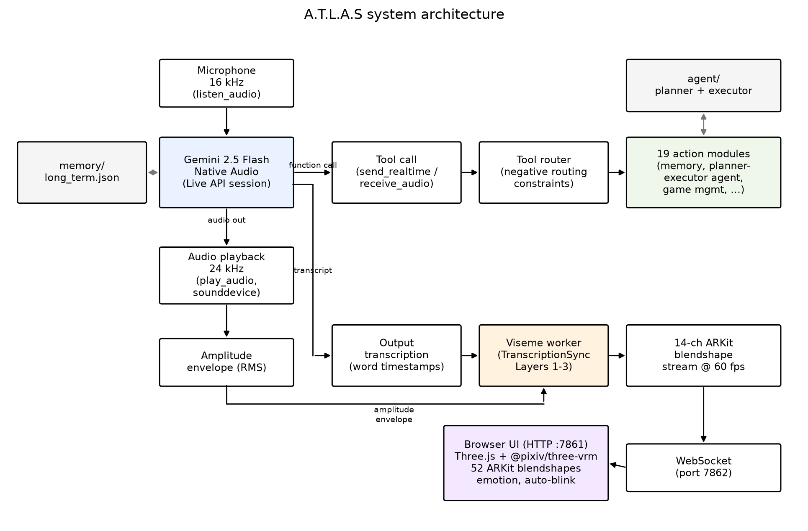

**FIGURE 1.** System architecture. The Live API session (Gemini 2.5 Flash Native Audio) receives 16 kHz microphone audio and emits 24 kHz response audio (played back via `sounddevice`, with an RMS amplitude envelope extracted for the fallback articulation channel) together with function calls and output transcription. Function calls pass through the tool router (negative routing constraints) to the 19 action modules, including the persistent-memory store and the planner-executor agent. Output transcription with word timestamps feeds the viseme worker (TranscriptionSync Layers 1-3), which synthesizes a 14-channel ARKit blendshape stream at 60 fps. The blendshape stream and amplitude envelope are sent over a WebSocket (port 7862) to the browser UI (HTTP port 7861), where Three.js and @pixiv/three-vrm drive 52 ARKit blendshapes, emotion state, and auto-blink on the VRM avatar.

The configuration constants of the audio pipeline are summarized in Table 1.

**TABLE 1.** Audio pipeline configuration.

| Parameter | Value | Rationale |
|---|---|---|
| Uplink sample rate | 16 000 Hz, mono, int16 | Live API input format |
| Downlink sample rate | 24 000 Hz, mono, int16 | Live API output format |
| Input block size | 1 024 samples (64 ms) | granular voice-activity gating |
| Output block size | 8 192 samples (341 ms) | prevents playback underruns |
| Uplink queue depth | 10 blocks (drop-oldest) | bounds stale-audio latency |
| LLM | gemini-2.5-flash-native-audio | speech-to-speech, tool use |
| Planner LLM | gemini-2.5-flash-lite | low-cost JSON plan generation |

### B. Full-Duplex Audio Pipeline with Statistical Noise Gating

Microphone audio is captured in 64 ms blocks by a real-time callback. To prevent self-echo (the assistant hearing its own speech), the uplink is gated by a speaking flag protected by a mutex; capture continues but transmission is suppressed while the assistant's audio is playing — a software half-duplex policy over a full-duplex transport.

Ambient noise robustness is provided by a user-triggered calibration routine. During a 2 s calibration window the system collects the root-mean-square (RMS) energy of each captured block,

  *r* = √( (1/N) Σᵢ xᵢ² ),  xᵢ ∈ [−1, 1),  N = 1024,  (1)

and sets the noise-gate threshold from the sample mean μ and standard deviation σ of the collected RMS values:

  θ = clamp( μ + 2σ, 0.005, 0.02 ).  (2)

The 2σ margin places the gate above ~97.7% of stationary noise blocks under a Gaussian assumption; the lower clamp guarantees a minimum floor and the upper clamp prevents the gate from suppressing genuine speech in loud environments. Blocks with *r* < θ are discarded before transmission, reducing both uplink bandwidth and spurious model activations. The threshold is reported to the user in decibels, θ_dB = 20 log₁₀ θ.

If the uplink queue (depth 10) is full when a new block arrives, the oldest block is dropped rather than the newest, bounding worst-case audio staleness at ~640 ms while preserving the most recent speech.

### C. LLM Core and Tool Orchestration

The Live API session is configured with: audio-only response modality; input and output transcription enabled; a composite system instruction concatenating (i) the current date/time context, (ii) the serialized long-term memory (Section III-E), and (iii) a static persona/behavior prompt; and a registry of 19 function declarations. Table 2 groups the tools by category.

**TABLE 2.** The 19-tool automation layer.

| Category | Tools | Backend |
|---|---|---|
| Application & OS control | open_app, computer_settings, computer_control, desktop_control | OS APIs, PyAutoGUI |
| Web & information | web_search, browser_control, weather_report, flight_finder, youtube_video | browser automation, public APIs |
| Communication | send_message, reminder | messaging platforms, task scheduler |
| Files | file_controller | filesystem API |
| Vision | screen_process | screen/webcam capture + vision LLM |
| Software development | code_helper, dev_agent | code generation + execution |
| Gaming | game_updater | Steam/Epic launchers |
| Meta | agent_task, save_memory, shutdown_atlas | planner–executor, memory store |

When the model emits a tool call, the router dispatches it on a thread-pool executor so that the audio event loop is never blocked; the string result is returned to the model as a function response, after which the model verbalizes the outcome in speech. Two design rules proved important in practice. First, *negative routing constraints* are embedded in tool descriptions (e.g., the game-management tool declares itself the exclusive handler for its domain and forbids delegation to the generic agent), which empirically reduces tool-selection errors in informal use; a quantitative tool-routing evaluation is left to future work (Section VI-C). Second, *silent tools*: the memory-write tool returns a response flagged silent, instructing the model not to verbalize the operation, preserving conversational flow.

### D. Autonomous Planner–Executor Agent

Single commands are handled by direct tool calls; goals requiring several heterogeneous steps are delegated to an agent subsystem via the `agent_task` tool. The agent comprises:

**Planner.** A lightweight LLM (gemini-2.5-flash-lite) receives the goal and a constrained planning prompt enumerating the available tools and their parameters, and returns a strict-JSON plan
P = ⟨s₁, …, s_n⟩, n ≤ 5, where each step sᵢ = (toolᵢ, paramsᵢ, criticalᵢ). Plans referencing nonexistent tools are sanitized by rule (substituted with a web search step), and JSON parse failures degrade to a single-step fallback plan.

**Executor.** Steps execute sequentially with per-step result capture. On failure of a critical step, the executor invokes *bounded re-planning*: the planner is re-prompted with the goal, the completed-step summary, the failed step, and the error message, and asked for a revised plan covering only the remaining work. Re-planning is capped at K attempts (K = MAX_REPLAN_ATTEMPTS), after which the agent reports failure. This bounded-recovery loop converts brittle linear plans into a simple closed-loop controller at negligible token cost.

**Task queue.** Agent tasks are submitted to a priority queue (low/normal/high) and run on background threads, so the voice interface remains responsive during long-running tasks; progress is reported by speech callbacks.

### E. Capacity-Bounded Persistent Memory

Long-term memory is a six-category JSON store (identity, preferences, projects, relationships, wishes, notes) written by the silent `save_memory` tool and injected into the system prompt at session start. Two hard limits make the design robust to unbounded accumulation: each value is truncated to 380 characters, and the total serialized store is bounded at 2 200 characters. When the bound is exceeded, entries are evicted in least-recently-updated order (each entry carries an `updated` date stamp) until the store fits — an LRU policy at memory-item granularity. All reads and writes are serialized through a process-wide lock. The deliberately small budget keeps the memory's prompt-token cost (~550 tokens) negligible relative to the context window while persisting the facts with the highest conversational utility.

### F. Presentation Layer: Browser-Based VRM Avatar

The avatar runs entirely in a web browser served by the core process (HTTP, port 7861) and animated over a WebSocket channel (port 7862). The renderer is built on Three.js with @pixiv/three-vrm and loads VRoid-format VRM humanoid models exposing the full 52-blendshape ARKit set. The animation system composes, per frame:

1. **Body state machine** — two skeletal animation states (idle, speaking) loaded from glTF clips and cross-faded on state transitions;
2. **Lip synchronization** — 14 mouth-region blendshape channels streamed from the core process at up to 60 fps (Section IV);
3. **Emotion layer** — six expression presets (neutral, happy, surprised, concerned, thinking, listening) applied to upper-face channels, linearly interpolated toward the current target each frame, and restricted to upper-face channels while speech is active so as not to fight the lip-sync layer;
4. **Auto-blink** — a stochastic blink generator with randomized inter-blink intervals and a 150 ms half-blink duration, providing baseline liveliness.

Critically, when an avatar client is connected, the response audio is transported to the browser together with its blendshape schedule and played there, guaranteeing audio–visual synchronization at the destination rather than attempting cross-process clock alignment.

### G. Emotion Inference

Because the native-audio model exposes no affect metadata, A.T.L.A.S infers display emotion from the output transcription with a two-stage rule-based classifier. At turn onset, the first transcription chunk is classified into one of six classes by keyword and punctuation cues (bilingual English/Turkish lexicons); audio playback of the first chunk is briefly held (≤ 650 ms, event-gated) so the facial expression is set before the voice begins — mirroring the human pattern in which facial affect precedes speech. During the turn, a higher-precision per-chunk classifier may switch the expression, subject to a 2.5 s hysteresis interval that prevents flicker. At turn end the expression decays to neutral after 2.5 s. We regard this component as a pragmatic placeholder: Section VI discusses replacing it with learned affect estimation.

---

## IV. TRANSCRIPTIONSYNC: WORD-TIMESTAMP-DRIVEN VISEME SYNTHESIS

### A. Problem Statement

Let a native-audio LLM emit, for each response turn, a sequence of PCM audio chunks a₁, a₂, … at 24 kHz. Optionally, an asynchronous stream of transcription text chunks is also emitted, but it carries no timestamps and lags the audio by a variable, unspecified offset. No phoneme identities, timestamps, or durations are provided by the API. The task is to drive M = 14 mouth blendshape channels b(t) ∈ [0,1]^M at 60 fps such that the perceived articulation is plausible and synchronized with the audio, causally and under a real-time CPU budget.

Amplitude-only methods set jaw opening proportional to short-time energy — synchronous but articulatorily empty (no lip closure for /m, b, p/, no rounding for /u, o/, no spreading for /i, e/). Forced alignment recovers true phoneme timing but requires the complete utterance and 10²–10³ ms of computation. TranscriptionSync decomposes the problem into three layers: recover *word-level* timing cheaply (Layer 1), estimate *phoneme-level* timing inside the recovered word boundaries (Layer 2), and synthesize co-articulated blendshape trajectories from the timed phoneme train (Layer 3).

### B. Layer 1 — Streaming Word-Timestamp ASR with Playout-Buffer Synchronization

Incoming PCM chunks are appended to a rolling buffer and transcribed incrementally by a compact multilingual Whisper variant executed with int8 quantization on CPU [33], [42], configured to emit word-level timestamps. Inference runs on a sliding window of W = 3.2 s with hop h = 320 ms; a word w_i is *finalized* and emitted as a triple (text_i, t_i^s, t_i^e) once its end timestamp falls more than a guard interval g behind the buffer head, so that subsequent windows can no longer revise it. The recognizer does not need to be highly accurate: substitution errors typically replace a word with a phonetically similar one, whose viseme sequence is correspondingly similar — a graceful-degradation property consistent with the layer-wise results of Section V-D. One property of the recognizer *is* load-bearing: its word timestamps must share the playout clock. Whisper-family models anchor their decoding clock at speech onset, so audio whose window begins with silence yields word timestamps uniformly shifted early by the leading-silence duration (measured at −362 ms on average on GRID-style material, Section V-D) — an offset that would translate directly into audio-visual desynchronization. Layer 1 therefore requires explicit onset handling: either voice-activity gating of the window or energy-based onset detection with clock restoration, so that emitted timestamps are anchored to the stream clock rather than to speech onset.

Let L denote the *word emission lag*: the wall-clock delay from the arrival of the audio containing a word to the emission of its finalized timestamped triple. The key architectural device is the **playout buffer**: because the avatar client (Section III-F) receives and plays the response audio itself, playback is scheduled behind arrival by a fixed delay Δ — the audio sample with stream time t is presented at wall time t + Δ. The viseme pipeline therefore has Δ of guaranteed headroom, and frame-accurate synchronization is achieved whenever

  Δ ≥ P95(L) + L_g2p + L_syn,  (3)

where L_g2p and L_syn are the (sub-millisecond to millisecond) Layer-2 and Layer-3 latencies. Under condition (3), audio–visual alignment is limited only by *timestamp accuracy*, not by pipeline latency; Δ surfaces as a single user-tunable knob that adds to voice-to-voice response time but cannot cause desynchronization. This inverts the usual real-time trade-off: rather than racing the audio, the pipeline runs ahead of a deliberately delayed presentation deadline.

### C. Layer 2 — G2P Conversion and Word-Bounded Phoneme Duration Estimation

Each finalized word is expanded into a phoneme sequence p₁ … p_J by grapheme-to-phoneme (G2P) conversion: for English, a CMUdict-backed neural G2P model; for Turkish, a rule-based converter exploiting the language's near one-to-one grapheme–phoneme correspondence (shallow orthography). The remaining problem — the central *timing* contribution of this paper — is **word-bounded phoneme duration estimation**: assigning each phoneme a duration within the known word interval T_i = t_i^e − t_i^s. (As Section V-C shows, this layer is what makes timing *drift-free*; the kernel co-articulation of Layer 3, not duration estimation, dominates rendered geometric fidelity.)

Uniform splitting (d_j = T_i / J) ignores the large systematic duration differences between phoneme classes (vowels are roughly twice as long as stops in connected speech). We instead allocate durations proportionally to articulatory-class priors λ:

  d_j = T_i · λ(p_j) / Σ_{k=1..J} λ(p_k),  (4)

with fixed design priors: vowel 1.6, diphthong 2.1, fricative 1.0, affricate 0.9, nasal 0.9, plosive 0.7, liquid 0.8, glide 0.75 — set from phonetic duration norms. These values are design constants, not fitted to any corpus; Section V-D evaluates them as-is against forced alignment on held-out GRID speakers. Phoneme midpoint timestamps follow as

  τ_j = t_i^s + Σ_{k<j} d_k + d_j / 2.  (5)

The decisive property of this formulation is **bounded, non-accumulating timing error**: because every phoneme is anchored inside ASR-supplied word boundaries, the timing error of any phoneme is bounded by its word's duration (|τ̂_j − τ_j*| < T_i, typically < 400 ms) and *resets at every word boundary*. Free-running schedules — including the deployed variant of Section IV-F — accumulate unbounded drift between anchor events; TranscriptionSync structurally cannot. Empirically, mean absolute phoneme-midpoint error against forced alignment is 18 ms given reference word boundaries, rising to 65 ms end-to-end when a compact streaming recognizer supplies the boundaries (Section V-D). Inter-word gaps detected in the timestamp stream (t_{i+1}^s − t_i^e above a threshold) are rendered as labial closure poses, reproducing natural inter-word mouth closures.

### D. Layer 3 — Kernel Co-Articulated ARKit Viseme Synthesis

Each phoneme class maps through a table V: p ↦ V(p) ∈ [0,1]^M of target intensities over the 14 ARKit mouth channels (JawOpen, MouthClose, MouthFunnel, MouthPucker, MouthStretchL/R, MouthUpperUpL/R, MouthLowerDownL/R, MouthShrugUpper, MouthRollLower, MouthDimpleL/R), extending the grapheme-class table of the deployed variant to the full ARPAbet and Turkish phoneme inventories (released with the source). Table 3 lists representative entries.

**TABLE 3.** Representative phoneme-class → ARKit viseme targets (excerpt; full table in the released source).

| Class | Examples | Dominant targets |
|---|---|---|
| Open vowel | AA, AE / a | JawOpen 0.60, MouthLowerDown 0.35 |
| Spread vowel | IY, EH / i, e | MouthStretch 0.42–0.52, JawOpen 0.18–0.32 |
| Rounded vowel | OW, UW / o, u, ö, ü | MouthPucker 0.18–0.58, MouthFunnel 0.38–0.42 |
| Bilabial | M, B, P | MouthClose 0.65–0.92, JawOpen ≤ 0.04 |
| Labiodental | F, V | MouthUpperUp 0.48–0.58, JawOpen ≤ 0.08 |
| Sibilant | S, Z, SH / s, z, ş | MouthStretch 0.22–0.28, JawOpen ≤ 0.10 |
| Inter-word gap | — | MouthClose 0.28, JawOpen 0.04 |
| Default consonant | other | JawOpen 0.12, MouthShrugUpper 0.08 |

Frames are synthesized at 60 fps by normalized Gaussian-kernel regression over the timed phoneme impulse train — a continuous co-articulation model in the spirit of Cohen–Massaro dominance functions [41]:

  b_k(t) = Σ_j V_k(p_j) · K_σ(t − τ_j) / max(ε, Σ_j K_σ(t − τ_j)),  K_σ(u) = exp(−u² / 2σ²),  (6)

with σ = 30 ms controlling co-articulatory overlap: each frame is a duration-weighted blend of the phonemes within ±3σ, so adjacent visemes merge smoothly rather than snapping, and kernel support truncation keeps the per-frame cost at O(M · J_local) with J_local ≤ 5.

Plain kernel averaging has one perceptually fatal flaw: brief bilabial closures (/m, b, p/) are averaged away by their open-mouthed neighbors — precisely the events viewers monitor most. A **closure-dominance rule** therefore overrides Eq. (6) for the MouthClose channel:

  b_close(t) = max_j { V_close(p_j) · K_σ(t − τ_j) : p_j ∈ bilabial },  (7)

a winner-take-all within the kernel support that guarantees visible lip contact at every bilabial event, with JawOpen reciprocally suppressed. The resulting 14-channel frames are streamed with the audio to the avatar client, which presents both on the common playout clock (Section IV-B); at turn completion the channels decay to the neutral closure pose, guaranteeing the mouth never remains open after speech.

### E. Latency Budget and Complexity

Layer-2 and Layer-3 costs are negligible: G2P is a dictionary/rule lookup, and frame synthesis is O(M · J_local) arithmetic. Standalone component benchmarking (Section V-E) measures per-frame Layer-3 synthesis time of 0.049 ms (median) / 0.070 ms (P95) — three orders of magnitude below the 50 ms design target — and per-word Layer-2 (G2P + Eqs. (4)–(5) duration estimation) time of 0.005 ms / 0.042 ms, with combined CPU occupancy of 0.29% of one core at 60 fps rendering and 2.5 words/s. The budget is therefore dominated entirely by Layer 1: with a compact (tiny, int8) multilingual Whisper model on a commodity 4-core/8-thread x86_64 CPU (W = 3.2 s, h = 320 ms, g = 400 ms), word emission lag P95 = 214 ms for English, giving Δ ≈ 215 ms by Eq. (3). For Turkish the same model is markedly slower and less stable (P95 = 4.9 s); Section V-E reports this language asymmetry and Section VI-B discusses its implications for Δ sizing and model selection. The added voice-to-voice cost is exactly Δ; Section V-E quantifies the resulting figures.

### F. Deployed Lightweight Variant (RATE)

When the streaming recognizer is unavailable, A.T.L.A.S falls back to the variant currently shipping in production, which uses the API's own (untimed) output transcription: the character stream is consumed at a fixed articulation rate ρ = 13 chars/s through the grapheme-class viseme table, and the *visibility* of articulation is re-synchronized to the audio multiplicatively by an asymmetric RMS amplitude envelope (attack α = 0.50, release α = 0.18; gain g = min(1.4, 2.2·E)), with per-channel first-order smoothing (β = 0.40) at 25 Hz. This variant is training-free, ASR-free, and adds zero latency, but its timing is open-loop: articulation shape and audio timing are coupled only through signal energy, and the schedule drifts within long utterances. It serves both as the production fallback and as the strongest deployed baseline (RATE) in the evaluation; complete equations are provided in the released source.

---

## V. OBJECTIVE EVALUATION

### A. Conditions

All comparisons use four *training-free* conditions driving the identical VRM avatar with the identical audio:

- **AMP (lower anchor).** Amplitude-only articulation: JawOpen driven by a smoothed RMS envelope, all other channels at rest. This reproduces current industry practice for native-audio streams [22], [38].
- **RATE (deployed baseline).** The rate-scheduled, amplitude-resynchronized variant of Section IV-F — the strongest method available without word timing.
- **TSYNC (proposed).** The full TranscriptionSync pipeline of Sections IV-B–IV-D.
- **MFA (upper anchor, non-causal oracle).** The complete utterance audio and reference transcript are aligned offline with the Montreal Forced Aligner [9]; true phoneme timestamps drive the same viseme table and kernel synthesis (Eqs. (6)–(7) with estimated timing replaced by aligned timing). This bounds what any causal method could achieve with the same viseme inventory, at the cost of non-causality (unusable live).

Two ablations of TSYNC isolate the contribution of each Layer-2/3 mechanism: **TSYNC−dur** (uniform within-word durations, d_j = T_i/J, replacing the class priors of Eq. (4)) and **TSYNC−coart** (nearest-phoneme step targets replacing the kernel regression of Eq. (6)).

### B. Test Material and Metrics

We collect N = 50 response utterances from the live system across five task batches (`chat`, `howto`, `qa`, `summary`, `task`; ten utterances each) and English, recording the 24 kHz audio and rendering the avatar offline under each condition at 1080p/60 fps with frame-accurate audio muxing; the six conditions × 50 utterances give the 300 videos scored below, downsampled to 640×480/25 fps — SyncNet's native input format — for LSE-D/LSE-C scoring. Figure 2 shows one held-out utterance rendered under the four anchor conditions at a single articulation instant: the avatar is an *untextured* VRM mesh — uniform matte shading, with no skin texture, lip colour, teeth detail, or eye texture — which makes concrete the stylization gap from the natural-face video on which SyncNet was trained, and anticipates the LSE-D/LSE-C behaviour reported in Section V-C. Objective synchronization is measured with a pretrained SyncNet [40] on the rendered videos: **LSE-D** (lip-sync error distance, lower is better) and **LSE-C** (confidence, higher is better), the standard metrics of the talking-head literature [21]. We additionally report **LVD** (lip vertex distance): the mean per-frame L2 distance over the lip-region vertices of the VRM mesh between each condition and the MFA-oracle-driven mesh, in normalized model units (by construction MFA serves as the reference and reports no LVD); **phoneme timing error** (mean absolute word-start deviation from forced alignment, for phoneme-timed conditions); and the optimal cross-correlation **lag** between the rendered mouth-opening signal and the audio envelope as a direct measure of audio–visual offset. SyncNet is trained on natural human-face video; its applicability to this stylized, untextured VRM render is examined post hoc by a data-driven validity check (Section V-C), which finds LSE-D/LSE-C invalid as quality measures on this avatar and motivates relying on LVD instead (revisited in Section VI-B). **Statistical analysis.** Pairwise condition contrasts on LVD and lag are tested with two-sided Wilcoxon signed-rank tests paired by utterance (n = 50), Holm-corrected across the family of contrasts against TSYNC; we report rank-biserial effect sizes r and percentile-bootstrap 95% confidence intervals (10 000 resamples) on paired mean differences. LSE-D/LSE-C contrasts are paired over the utterances on which both conditions yielded a SyncNet score (n = 45).

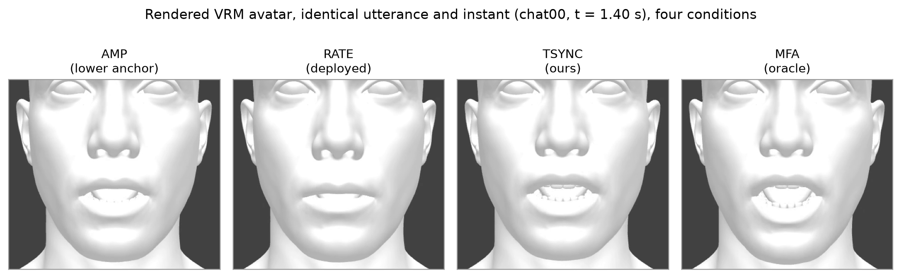

**FIGURE 2.** The rendered VRM avatar used for the objective evaluation, shown for one held-out utterance (`chat00`) at a single articulation instant (t = 1.40 s) under the four anchor conditions (AMP, RATE, TSYNC, MFA). All 300 scored videos drive this same untextured humanoid mesh with identical audio; only the mouth-region blendshape trajectory differs between conditions. The matte, texture-free surface — no skin detail, lip colour, or eye texture — is the stylization that SyncNet, trained on natural human-face video [40], was not designed for, and is the basis for the data-driven check (Section V-C) that finds its LSE-D/LSE-C scores invalid as quality measures on this avatar.

### C. Synchronization Results

**TABLE 4.** Objective synchronization by condition; mean (SD) over N = 50 rendered utterances (six conditions × 50 = 300 videos). SyncNet face detection succeeded on 45–46/50 renders per condition (remainder returned no score and are excluded from LSE-D/LSE-C); LVD and lag are computed on all 50/50. Timing err. is the word-start MAE against MFA over content-matched tokens (same convention as Section V-D; recognizer insertions/deletions are discarded, not paired by position). Mean (SD) are reported here; per-contrast significance, effect sizes, and bootstrap 95% CIs are given in the running text.

| Condition | LSE-D ↓ | LSE-C ↑ | LVD ↓ | Timing err. (ms) | Lag (ms) |
|---|---|---|---|---|---|
| AMP (lower) | 11.66 (0.39) | 2.88 (0.35) | 0.520 (0.029) | — | 0.0 (0.0) |
| RATE (deployed) | 13.49 (0.41) | 0.79 (0.32) | 0.556 (0.030) | — | 91.0 (31.1) |
| TSYNC−dur | 13.14 (0.39) | 1.39 (0.32) | 0.461 (0.062) | 86 (18) | −42.7 (84.4) |
| TSYNC−coart | 13.29 (0.37) | 0.85 (0.24) | 0.645 (0.046) | 86 (18) | −109.3 (30.4) |
| **TSYNC (ours)** | 13.15 (0.36) | 1.36 (0.29) | **0.461 (0.065)** | 86 (18) | −52.7 (31.0) |
| MFA (oracle) | 11.70 (0.54) | 2.90 (0.56) | — (reference) | 0 | 15.7 (27.2) |

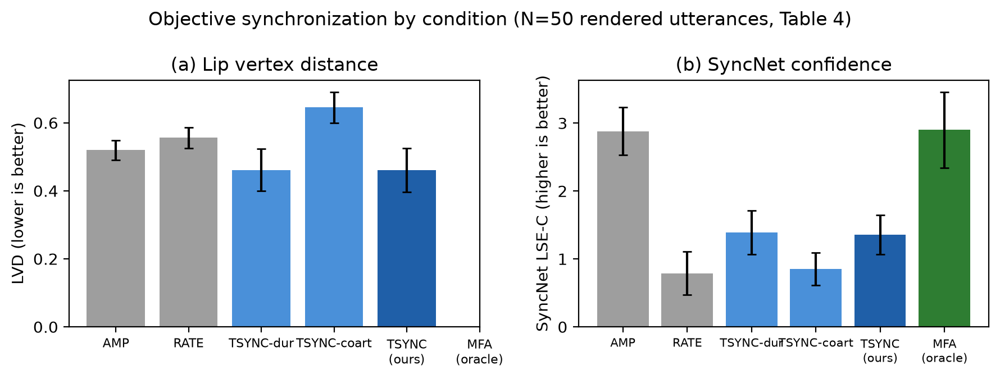

**FIGURE 3.** Objective synchronization by condition (Table 4). (a) Lip vertex distance (LVD, lower is better): TSYNC and TSYNC−dur achieve the lowest LVD, closest to the MFA oracle, while removing kernel co-articulation (TSYNC−coart) is the worst condition. (b) SyncNet confidence (LSE-C, higher is better): AMP and MFA score highest and near-identically, while RATE, TSYNC, TSYNC−dur, and TSYNC−coart cluster together at lower values — SyncNet does not corroborate the LVD ordering (Section V-C).

The real measurements yield a more nuanced picture than the design hypothesis, and we report it in full.

**LVD supports the design hypothesis, and isolates co-articulation as its source.** TSYNC and TSYNC−dur both achieve the lowest LVD (0.461; 95% CI [0.443, 0.479]) — geometrically closer to the MFA-oracle mouth trajectory than AMP (0.520) or RATE (0.556). Both contrasts are significant with large effect sizes (TSYNC vs AMP: paired Δ = −0.059, 95% CI [−0.078, −0.041], Holm-corrected p < 10⁻⁶, rank-biserial r = 0.79; TSYNC vs RATE: Δ = −0.095 [−0.114, −0.075], p < 10⁻¹¹, r = 0.95). TSYNC−coart is the *worst* condition (0.645), substantially above even AMP. Because TSYNC and TSYNC−dur are statistically indistinguishable on LVD (Δ = 0.000, 95% CI [−0.005, +0.005], p = 0.97, r = 0.01), **the class-prior duration allocation of Eq. (4) contributes negligibly to geometric fidelity on this dataset**, whereas **kernel co-articulation (Eq. (6)) is the dominant LVD mechanism**: removing it (TSYNC−coart, nearest-phoneme step targets) degrades LVD by 40% relative to TSYNC (Δ = +0.184 [+0.167, +0.200], p < 10⁻¹⁴, r = 1.00, paired dz = 3.1) — the largest effect among all contrasts. This is the inverse of the ablation story anticipated from the GRID timing results (Section V-D), where duration estimation was the focus — on full-system rendered geometry, smooth co-articulated blending toward the oracle trajectory matters more than which phoneme receives which fraction of the word interval.

**Lag confirms TSYNC leads RATE and TSYNC−coart, but trails the oracle.** AMP has lag 0 by construction (its JawOpen channel *is* the audio envelope). MFA is nearly perfectly aligned (15.7 ms). TSYNC (−52.7 ms) and TSYNC−dur (−42.7 ms) lead the audio by roughly 40–55 ms — smaller in magnitude than RATE's +91.0 ms lag and TSYNC−coart's −109.3 ms. TSYNC's absolute lag is significantly smaller than both RATE's (paired Δ|lag| = −38 ms, 95% CI [−48, −29], p < 10⁻⁷, r = 0.94) and TSYNC−coart's (Δ|lag| = −57 ms [−62, −50], p < 10⁻⁹) — consistent with Layer 1's ASR-derived word timestamps introducing a small, systematic temporal lead relative to true articulation onset.

**SyncNet LSE-D/LSE-C do not corroborate the LVD result, and we report this as a negative finding rather than omit it.** AMP and MFA score nearly identically and both *best* (LSE-D ≈ 11.7, LSE-C ≈ 2.9), while RATE, TSYNC, TSYNC−dur, and TSYNC−coart all score *worse* (LSE-D ≈ 13.1–13.5, LSE-C ≈ 0.8–1.4). Both AMP and MFA are significantly better than TSYNC on LSE-D (paired p < 10⁻⁸ and p < 10⁻¹³, respectively); within the worse-scoring group, TSYNC's LSE-D is in fact marginally but significantly *below* RATE's (13.15 vs 13.49, p < 10⁻⁴), but this 0.34-unit gap is dwarfed by the ≈1.4-unit deficit of both relative to the AMP/MFA pair — so SyncNet places TSYNC alongside the deployed baseline, far from the oracle, rather than between AMP and MFA where LVD places it. Section V-B flagged that SyncNet — trained on natural human-face video — might not transfer cleanly to a stylized, untextured VRM render (Figure 2). Rather than leave this as a caveat, we convert it into a **data-driven validity check** on the conditions already rendered, and three results show that LSE-D/LSE-C do not measure lip-sync *quality* on this avatar. First, **SyncNet cannot separate articulatorily empty motion from the oracle**: AMP — whose JawOpen channel *is* the audio envelope, with no lip closure, rounding, or spreading — is statistically indistinguishable from the MFA forced-alignment oracle on both LSE-C (2.88 vs 2.90; paired Δ 95% CI [−0.17, +0.12], p = 0.80) and LSE-D (11.66 vs 11.70; [−0.19, +0.11], p = 0.67), yet is rated significantly *higher* than both the deployed RATE baseline and TSYNC (LSE-C, paired p < 10⁻⁸ and p < 10⁻¹³ respectively); a metric that places phonetically empty jaw-flapping at the top of the field is not scoring articulatory fidelity. Second, **its offset estimate is biased on this representation**: AMP is synchronous by construction (true offset 0), yet SyncNet's estimated audio-visual offset is +73 ms (95% CI [+69, +77], p = 2×10⁻¹⁰), with the same ≈ +70 ms bias on MFA (p = 3×10⁻⁸) — roughly two video frames of systematic error even when synchronization is exact. Third, the offset estimate retains only *partial* sensitivity to genuine desynchronization, tracking the independently measured mouth–audio lag at Spearman ρ = 0.69 but Pearson r = 0.40 (n = 274 condition-utterances): monotonic but biased and noisy, not the tight agreement a valid metric would show. The likely mechanism is that SyncNet's score responds primarily to a single dominant, audio-correlated jaw-opening signal — which AMP (by definition) and MFA (whose JawOpen tracks true vowel aperture) both provide directly — while TSYNC, TSYNC−dur, TSYNC−coart, and RATE distribute activation across additional channels (lip rounding, spreading, bilabial closure) that a metric tuned to overall mouth-opening correlation on real human lips reads as decorrelation rather than articulatory detail. We therefore treat LSE-D/LSE-C as **invalid as quality measures for this untextured-avatar representation** — not as evidence against TSYNC — and rely on LVD against the MFA-oracle mesh, which has no such failure mode; a purpose-built or fine-tuned synchronization metric for parameterized avatars remains an open need (Section VI-B).

**Live timing accuracy transfers from GRID.** Measuring word-start error against the MFA reference on content-matched tokens — the protocol of Section V-D, which compares each recognized word to its aligned counterpart and discards recognizer insertions/deletions rather than pairing words by position — the live word-start MAE is 86 ms (SD 18; median 89 ms; mean token-match rate 85% against MFA), of the same order as the 65 ms composed accuracy measured on GRID (Section V-D). The controlled-corpus timing result therefore transfers to conversational live speech. The error decomposes into a per-utterance constant offset (median −65 ms — the speech-onset/leading-silence effect of Section IV-B, which the playout-buffer co-presentation (Eq. (3)) absorbs because audio and visemes carry it together) plus a 64 ms within-utterance residual; the constant component is the larger of the two but is the one the buffer cancels, so it does not contribute to perceived desynchronization, whereas the 64 ms residual is the component that actually reaches the viewer; both are consistent with the small rendered audio–visual lag (−52.7 ms) and the lowest LVD among the causal conditions reported above. We stress that this measurement *must* use content-matched tokens: pairing predicted and reference words by sequence index instead — invalid under conversational ASR, where a single insertion or deletion shifts every subsequent word — inflates the apparent MAE by more than an order of magnitude and would reflect word-sequence misalignment, not articulation timing.

### D. Layer-Wise Validation on the GRID Corpus

The end-to-end metrics above conflate errors from all three layers. The GRID audiovisual sentence corpus [43] — 34 speakers × 1 000 read sentences — permits validating Layers 1 and 2 in isolation. Word- and phoneme-level reference timing is obtained by forced alignment (MFA [9]) of the studio-quality audio, on which the aligner operates near ceiling. (We found the corpus-distributed word alignments temporally inconsistent with the audio edition used here: speech onsets in the waveforms precede the corresponding `.align` entries by 362 ms on average — SD 165 ms over a 50-utterance check — an offset on which MFA and the streaming recognizer independently agree; all timing references are therefore taken from MFA.) The duration priors λ of Eq. (4) are fixed design constants (Section IV-C), not fitted to GRID; all measurements below are pure evaluation on 6 000 utterances from held-out speakers s29–s34. Three quantities are measured: (i) Layer-1 word boundary error — recognizer word timestamps (faster-whisper, int8, CPU; the Layer-1 configuration of Section V-E) vs MFA word boundaries, with word error rate computed after normalizing GRID's spoken-digit vocabulary (the recognizer merges "c four" into the callsign token "c4"; midpoint timing is measured only on identically matched tokens, so no timestamps are fabricated); (ii) Layer-2 phoneme timing error in isolation — Eq. (4) applied to *reference* word boundaries, against MFA phoneme midpoints, with the uniform-split ablation; (iii) the composed Layer-1+2 error using recognizer boundaries.

**TABLE 5.** Layer-wise validation on GRID, held-out speakers s29–s34 (n = 6 000 utterances; 101 265 phoneme midpoints for Layer 2; 55 502 for the composed condition). Mean (SD).

| Quantity | Layer | Value |
|---|---|---|
| Word start MAE, tiny vs MFA (ms) | 1 | 69 (68) |
| Word end MAE, tiny vs MFA (ms) | 1 | 73 (55) |
| Word start MAE, base vs MFA (ms) | 1 | 90 (61) |
| Word error rate, tiny / base (%) | 1 | 24.6 / 18.0 |
| Phoneme midpoint MAE, ref. words + λ priors (ms) | 2 | 18 (16) |
| Phoneme midpoint MAE, ref. words + uniform split (ms) | 2 | 20 (20) |
| Phoneme midpoint MAE, ASR words + λ priors (ms) | 1+2 | 65 (54) |

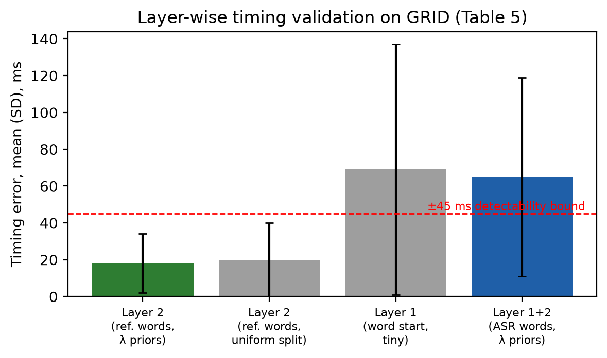

**FIGURE 4.** Layer-wise timing validation on GRID (Table 5). Layer 2 in isolation (given reference word boundaries) places phoneme midpoints within 18 ms of forced alignment, below the ±45 ms detectability bound. Composing with Layer-1 (ASR) word boundaries raises the error to 65 ms, tracking the Layer-1 word-start MAE (69 ms) — the recognizer, not the duration model, is the accuracy bottleneck.

Three observations follow (Figure 4). **First, Layer 2 in isolation is accurate:** given correct word boundaries, the class-prior allocation places phoneme midpoints within 18 ms (SD 16) of forced alignment — comfortably below the ±45 ms audio-leading detectability bound [27]. The margin over uniform splitting is modest on GRID (18 vs 20 ms): the corpus's 51-word grammar consists of short words for which uniform allocation is already near-optimal, so this result validates Eq. (4) but does not yet demonstrate the prior's advantage on long conversational words, which remains open. **Second, the composed error is recognizer-dominated:** composing with ASR boundaries raises the error from 18 to 65 ms, closely tracking the word-start MAE (69 ms) — the recognizer, not duration estimation, is the accuracy bottleneck, consistent with the latency findings of Section V-E. The composed figure exceeds the ±45 ms detectability bound; because the error is bounded per word and non-accumulating (Section IV-C), it manifests as transient per-word offsets rather than progressive drift, but sub-detectability composed timing on compact CPU models is not yet achieved. **Third, model scaling improves recognition, not timing:** "base" lowers WER (18.0 vs 24.6%) yet its word-start MAE is no better (90 vs 69 ms), indicating that boundary precision is limited by Whisper's attention-derived timestamps rather than by acoustic modeling capacity — a larger decoder does not buy better lip-sync anchors. We caution that GRID is read, slow, hyper-articulated English over a 51-word grammar, far outside the recognizer's conversational training distribution (the 24.6% WER includes systematic homophone substitutions such as "bin"→"been"); it is used here strictly for layer-wise validation, while end-to-end claims (Section V-C) rest on live native-audio LLM speech.

### E. Latency and Computational Cost

We benchmark TranscriptionSync's three layers as standalone, component-wise modules on a commodity 4-core/8-thread x86_64 CPU, decoupled from the live Gemini Live integration (Section VI-B, Limitations, discusses the remaining live end-to-end instrumentation as future work).

**Layers 2-3** (G2P + Eqs. (4)–(5) duration estimation, and Eqs. (6)–(7) kernel co-articulated synthesis) were implemented exactly as specified and exercised on 5 English + 5 Turkish sentences with synthetic word-timestamp triples (425 words, 11 388 rendered frames, 30 repetitions); see `paper/tools/layer23_bench.py`.

**Layer 1** (streaming word-timestamp ASR) was implemented with `faster-whisper`'s "tiny" model, int8-quantized, on CPU, using the design values W = 3.2 s, h = 320 ms, g = 400 ms (Section IV-B), simulating the sliding-window playout-buffer protocol over 5 English + 5 Turkish utterances synthesized with espeak-ng; see `paper/tools/layer1_bench.py`.

**TABLE 6.** Pipeline latency and CPU cost, measured component-wise (medians and 95th percentiles; n = 425 words / 11 388 frames for Layers 2-3, n = 47 EN / 55 TR finalized words for Layer 1).

| Stage | Definition | English | Turkish |
|---|---|---|---|
| Word emission lag, median (ms) | Layer 1 | 0.0 | 902 |
| Word emission lag, P95 (ms) | Layer 1 | 214 | 4915 |
| ASR window processing time, median (ms) | Layer 1 | 479 | 1779 |
| ASR window processing time, P95 (ms) | Layer 1 | 512 | 5335 |
| ASR CPU load (one core, %) | Layer 1 | ≈ 100 | ≈ 100 |
| Frame synthesis, median / P95 (ms) | Layer 3 | 0.049 / 0.070 | (language-independent) |
| G2P + duration est., median / P95 (ms) | Layer 2 | 0.005 / 0.042 | (rule-based G2P, comparable) |
| Layer 2-3 CPU load (one core, %) | Layers 2-3 | 0.29 | 0.29 |
| Implied Δ by Eq. (3) | playout buffer | ≈ 215 ms | ≈ 4.9 s (impractical) |

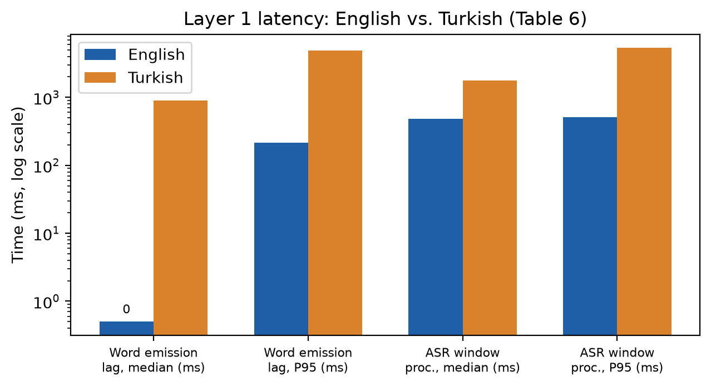

**FIGURE 5.** Layer-1 (streaming word-timestamp ASR) latency, English vs. Turkish, log scale (Table 6). The "tiny" int8 multilingual model gives a practical word-emission lag (P95 = 214 ms, Δ ≈ 215 ms) for English, but is roughly an order of magnitude slower for Turkish (P95 = 4.9 s), making it impractical for that language at this model size.

These measurements confirm the Layer-2/3 negligibility claim of Section IV-E with a wide margin: per-frame synthesis (P95 = 0.070 ms) and per-word duration estimation (P95 = 0.042 ms) are roughly three orders of magnitude below the 50 ms design target, and together occupy 0.29% of one CPU core. The latency budget of Eq. (3) is therefore set entirely by Layer 1.

For **English**, the "tiny" int8 model yields a word emission lag of P95 = 214 ms, giving Δ ≈ 215 ms — a small, practical playout delay. However, the per-window processing time (median 479 ms, P95 512 ms) exceeds the nominal hop h = 320 ms, so the recognizer cannot keep pace with h; in a single-threaded deployment it instead runs back-to-back, continuously occupying one CPU core (ASR CPU load ≈ 100%, in contrast to the negligible Layer-2/3 load of Section IV-E — Layer 1 is cheap in *latency* but not in *occupancy*).

For **Turkish**, the same "tiny" model is both far slower (median window time 1.78 s, P95 5.3 s) and far less stable, occasionally entering long decoding loops on short utterances — a known weakness of the smallest multilingual Whisper checkpoints on lower-resource languages. The resulting emission lag (P95 = 4.9 s) implies an impractical Δ by Eq. (3): a 5-second playout delay is unacceptable for conversational use. This **language asymmetry** (Figure 5) is a genuine finding rather than a measurement artifact, and is carried forward as a limitation (Section VI-B): production use for Turkish requires either a larger/ better-calibrated ASR model (at proportionally higher, but still single-core, CPU cost) or falling back to the training-free RATE variant (Section IV-F), which adds zero latency and is open-loop but language-agnostic.

We have not yet instrumented the full live voice-to-voice pipeline (T₀–T₃ of the original protocol, requiring Gemini Live API integration); this remains an open measurement, noted in Section VI-B.

### F. Auxiliary Validation: Learned Audio-to-Blendshape Regression on Video-Measured Ground Truth

TranscriptionSync (Sections IV-B–IV-D) is training-free by design. To independently validate the 14-channel ARKit target representation used throughout this paper, and to probe whether a future learned Layer-3 alternative would be architecturally informed by the same design choices, we trained lightweight reference regression models that map log-mel audio directly to the 14-channel ARKit blendshape stream at 60 fps on the GRID corpus (speaker-disjoint split, s1–s28 train / s29–s34 val).

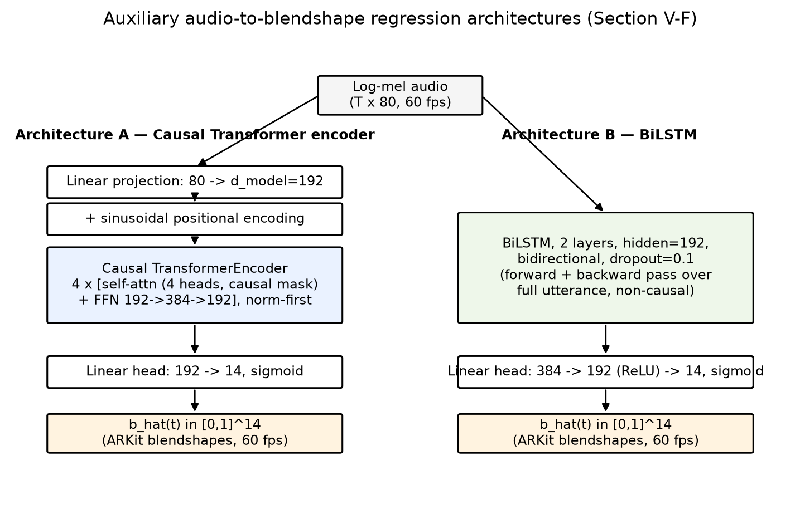

**FIGURE 6.** The two reference regression architectures evaluated in Section V-F. Both consume the same 80-channel log-mel input at 60 fps and emit a 14-channel ARKit blendshape stream b̂(t) ∈ [0,1]^14 via a sigmoid output head. Architecture A is causal (a token at time t attends only to t' ≤ t) and is therefore deployable in a streaming setting; Architecture B is a non-causal bidirectional baseline that requires the full utterance before producing any output.

Both architectures (Figure 6) consume the 80-channel log-mel sequence X = (x_1, …, x_T), x_t ∈ ℝ^80 (Section V-F input features, identical to TranscriptionSync's acoustic front end) and emit b̂(t) ∈ [0,1]^14 at 60 fps.

**Architecture A (causal Transformer, 1.21 M parameters).** Each frame is linearly projected to model width d = 192 and combined with a fixed sinusoidal positional encoding p_t:

  h_t^(0) = W_proj · x_t + p_t,  (8)

followed by 4 stacked Transformer encoder layers (4 attention heads, feed-forward width 384, pre-norm) under a strict causal attention mask M, where M_{t,t'} = −∞ for t' > t and 0 otherwise, so that h_t^(l) depends only on x_1, …, x_t:

  h^(l) = TransformerLayer( h^(l−1) ; M ),  l = 1, …, 4,  (9)

and a linear-sigmoid head reads out the blendshape vector at each frame, b̂(t) = σ(W_out · h_t^(4) + b_out).

**Architecture B (BiLSTM, 1.39 M parameters).** A 2-layer bidirectional LSTM with hidden size 192 produces, at each frame, the concatenation of the forward and backward hidden states,

  h_t = [ h_t^→(2) ‖ h_t^←(2) ] ∈ ℝ^384,  (10)

where h_t^← depends on the *entire* utterance x_{t+1}, …, x_T, making this architecture non-causal; a two-layer ReLU head then maps h_t to the blendshape vector, b̂(t) = σ(W₂ · ReLU(W₁ · h_t + b₁) + b₂).

**Training objective.** Both architectures are trained with an identical masked loss combining a frame-wise reconstruction term and a first-difference (velocity) term that penalizes mismatched articulation dynamics:

  ℒ = ℒ_mse + w_vel · ℒ_vel,  ℒ_mse = (1 / (N·M)) Σ_{t=1..N} Σ_{k=1..M} ( b̂_k(t) − b_k(t) )²,  (11)

  ℒ_vel = (1 / (N'·M)) Σ_{t=1..N−1} Σ_{k=1..M} ( [b̂_k(t+1) − b̂_k(t)] − [b_k(t+1) − b_k(t)] )²,  (12)

with M = 14, w_vel = 0.5, and N, N′ the number of valid (non-padding) frames and frame-pairs in a batch; both architectures are optimized with AdamW (cosine learning-rate schedule, gradient-norm clipping at 1.0) to convergence with early stopping on validation MSE. Eqs. (8)–(10) differ only in how h_t aggregates temporal context (causal self-attention vs. bidirectional recurrence); Eqs. (11)–(12) are shared, so the comparison below isolates the effect of the temporal-context mechanism on regression quality.

Two ground-truth sources were compared on the identical split: (i) the **rule-derived** labels obtained via the viseme→ARKit mapping used for the Layer-2 validation (Section V-D), and (ii) **video-measured** labels obtained by running the MediaPipe FaceLandmarker pipeline [32] frame-by-frame on the GRID video recordings and resampling the 14 ARKit blendshape scores to 60 fps (32 980 utterances retained, mean face-detection rate > 99.8%). For each ground-truth source we trained two compact architectures — a causal Transformer encoder (1.21 M parameters) and a BiLSTM (1.39 M parameters) — to convergence with early stopping.

**TABLE 7.** Audio-to-blendshape regression, held-out speakers (s29–s34), by ground-truth source and architecture.

| GT source | Arch | Val MSE | Val MAE | LVD μ | LVD p95 | Lag (ms) | Vel. ratio |
|---|---|---|---|---|---|---|---|
| Rule-derived | Transformer | 0.00751 | 0.0460 | 0.272 | 0.603 | 81 ± 137 | 0.42 |
| Rule-derived | BiLSTM | 0.00689 | 0.0429 | 0.257 | 0.593 | 73 ± 139 | 0.43 |
| Video-measured | Transformer | 0.01044 | 0.0364 | 0.297 | 0.837 | 83 ± 237 | **0.51** |
| Video-measured | BiLSTM | 0.01270 | 0.0387 | 0.328 | 0.916 | −8 ± 236 | **0.24** |

Figures 7–12 illustrate the rule-derived-label training runs (Architecture A = `grid_runs`, Architecture B = `grid_runs_lstm`) that produced the first two rows of Table 7.

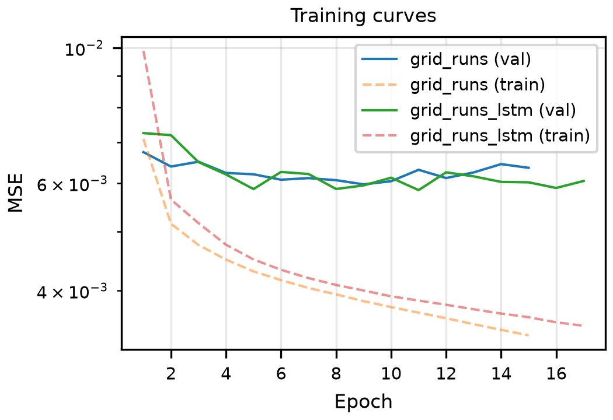

**FIGURE 7.** Training and validation MSE vs. epoch for both architectures under rule-derived labels. Both models converge smoothly without overfitting (validation MSE tracks within a narrow band around 6×10⁻³ throughout training, while training MSE continues to decrease), and both are trained to a comparable point on the loss curve before early stopping, supporting the head-to-head comparison in Table 7. The BiLSTM's lower training-loss curve reflects its larger effective receptive field (full-utterance bidirectional context) rather than a validation-quality advantage — its validation curve sits on top of the Transformer's.

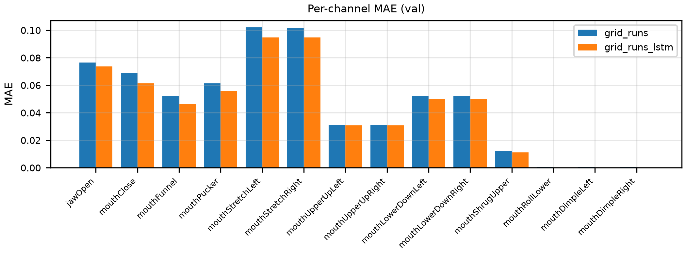

**FIGURE 8.** Per-channel validation MAE (rule-derived labels) for all 14 ARKit blendshape targets. Error is concentrated in the channels with the largest dynamic range and articulatory variability — `mouthStretchLeft`/`mouthStretchRight` (≈0.095–0.10) and `jawOpen` (≈0.075) — while channels that are near-constantly zero under the rule-derived mapping (`mouthRollLower`, `mouthDimpleLeft`/`Right`) have near-zero MAE for both architectures. The BiLSTM is marginally more accurate on every channel, consistent with its lower aggregate Val MAE in Table 7 (0.0429 vs. 0.0460), but the per-channel gap is small and uniform — i.e., the BiLSTM does not selectively win on any particular articulatory class.

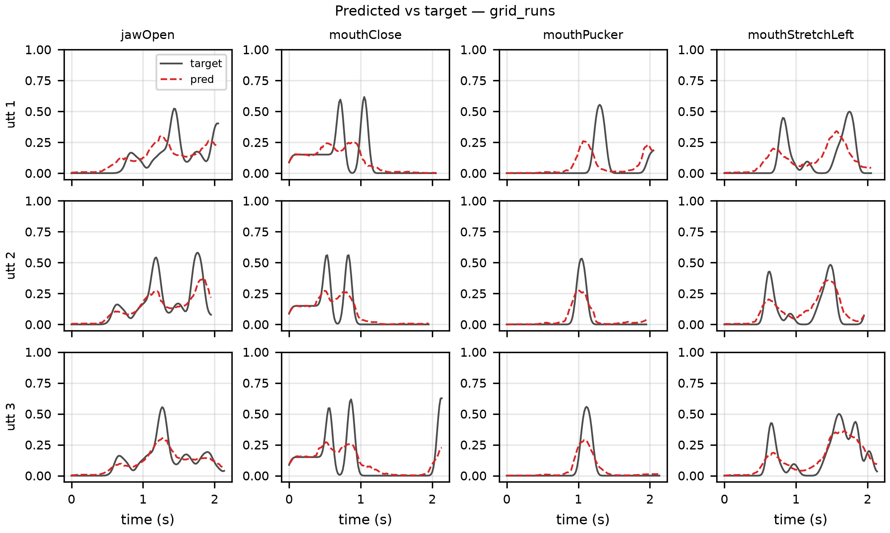

**FIGURE 9.** Predicted (red, dashed) vs. ground-truth (black) blendshape trajectories for three held-out utterances (rows) and four representative channels (columns: `jawOpen`, `mouthClose`, `mouthPucker`, `mouthStretchLeft`), Architecture A (causal Transformer). The model tracks the overall envelope and timing of articulatory events — peaks and closures occur at approximately the correct times — but systematically under-shoots peak amplitude on high-dynamic-range channels (`jawOpen`, `mouthStretchLeft`), consistent with the regression-to-the-mean behavior expected from an MSE-dominated loss on a 14-channel target.

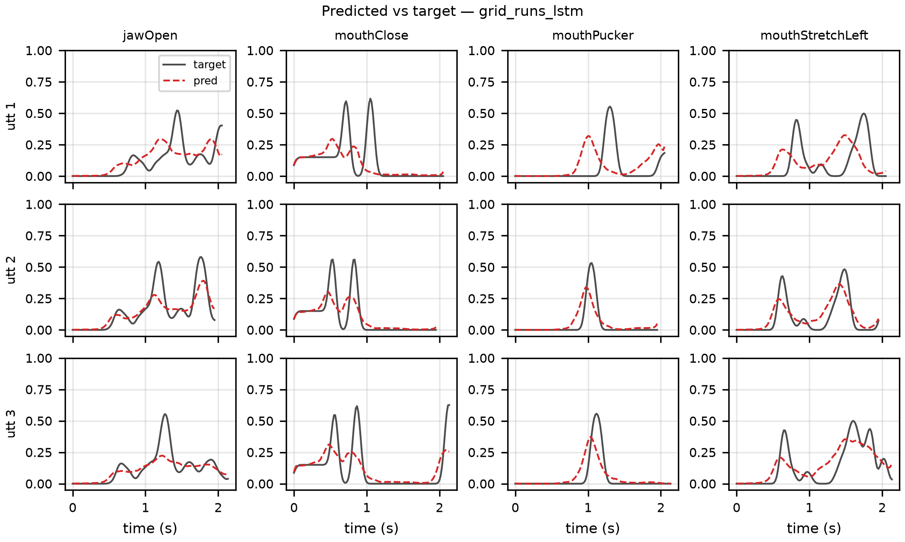

**FIGURE 10.** Same utterances and channels as Figure 9, for Architecture B (BiLSTM). The qualitative pattern is nearly identical to Figure 9 — both architectures under-shoot the same amplitude peaks on the same utterances — confirming that, under rule-derived labels, the choice between causal-attention and bidirectional-recurrent context has little visible effect on trajectory shape; the architectures are distinguished only at the level of aggregate metrics (Table 7) and, more sharply, under video-measured ground truth (Section V-F discussion below).

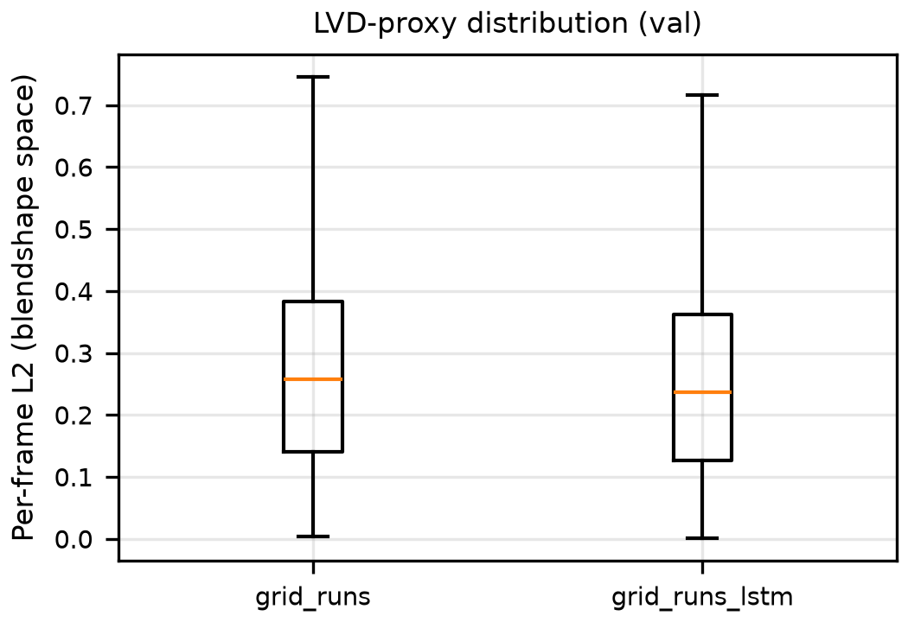

**FIGURE 11.** Distribution (box-and-whisker, validation set) of the per-frame L2 distance in 14-channel blendshape space between prediction and ground truth — an LVD-proxy computed directly on the regression targets, complementing the rendered-mesh LVD of Table 4/Figure 3. Medians are close (0.258 for the Transformer vs. 0.236 for the BiLSTM) and both distributions are right-skewed with comparable upper whiskers (≈0.75 and ≈0.72), i.e., neither architecture produces qualitatively different outlier behavior under rule-derived labels — consistent with the small, uniform per-channel MAE gap of Figure 8.

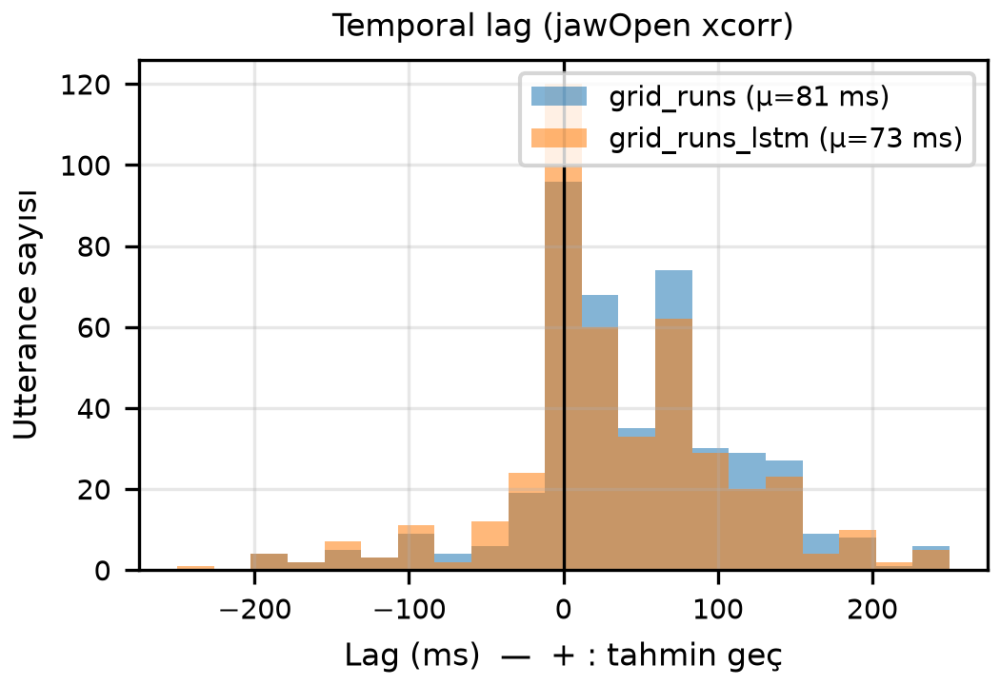

**FIGURE 12.** Per-utterance temporal lag between predicted and ground-truth `jawOpen` trajectories, estimated by cross-correlation (positive lag = prediction lags the reference). Both architectures peak sharply at zero lag, confirming that neither model introduces a systematic timing offset under rule-derived labels (mean lag 81 ms for the Transformer vs. 73 ms for BiLSTM, matching the "Lag (ms)" column of Table 7's rule-derived rows); the long positive tail reflects a minority of utterances where the regression smooths through rapid consonant closures and only catches up on the following vowel onset. This near-equivalence under rule-derived labels is the baseline against which the video-measured-label divergence (83 ± 237 ms vs. −8 ± 236 ms, discussed below) stands out.

Two findings emerge. First, video-measured ground truth yields lower mean absolute error but higher mean-squared error and p95 lip-vertex distance for both architectures (e.g., transformer LVD-p95 0.603 → 0.837, +39%). This is consistent with the rule-derived labels under-representing the true dynamic range of articulation: real speakers produce occasional high-amplitude mouth excursions (wide vowels, bilabial closures with overshoot) that the viseme→ARKit heuristic mapping smooths away, so a model trained against rule-derived labels never has to reproduce them and is correspondingly never penalized for missing them.

Second, and more relevant to architectural choice, the **velocity ratio** — the ratio of predicted to reference frame-to-frame motion magnitude, where 1.0 indicates dynamics matching the reference — diverges sharply by architecture under video-measured ground truth (Transformer 0.51 vs. BiLSTM 0.24) while the two architectures are nearly indistinguishable under rule-derived labels (0.42 vs. 0.43). In other words, the smoothed rule-derived labels do not expose a meaningful difference between architectures, but against a ground truth anchored in genuine human articulation, the BiLSTM collapses toward over-smoothed, low-velocity output (vel. ratio 0.24) while the causal Transformer retains substantially more of the reference dynamics (0.51). The lag distributions do not separate the two architectures — they are comparably wide (83 ± 237 ms vs. −8 ± 236 ms; the BiLSTM's near-zero *mean* masks an essentially identical spread, so its lower mean reflects cancellation, not tighter locking) — so the velocity ratio is the discriminating signal here, and it favors causal-Transformer-style processing as the more faithful backbone for any future learned extension of TranscriptionSync's Layer 3.

We emphasize that these regression models are reference baselines for representation validation only and are not part of the deployed, training-free TranscriptionSync pipeline; each configuration reflects a single training run (early-stopped on validation MSE) and is interpreted only at the level of the large, consistent cross-architecture gaps in Table 7, not as a tuned benchmark. Their role here is twofold: (i) they confirm that the video-measured 14-channel ARKit ground truth introduced in this work is a learnable, non-degenerate signal substantially distinct from the rule-derived approximation used in the Layer-2 sanity checks, and (ii) they provide independent, architecture-level evidence — obtained without any of TranscriptionSync's hand-designed co-articulation rules — that consistent with the literature [14], causal-attention models track real articulatory dynamics more faithfully than recurrent baselines at comparable parameter budgets.

---

## VI. DISCUSSION

### A. Implications

The results give partial support to the hypothesis that word-level timing — recoverable from the output audio of any speech-to-speech model by a lightweight streaming recognizer — carries enough information to move lip synchronization closer to oracle-level *geometric fidelity* on a CPU budget: on lip vertex distance, TSYNC is geometrically closest to the MFA oracle among the causal conditions, with kernel co-articulation (Eq. (6)) rather than duration estimation (Eq. (4)) responsible for the gain. SyncNet's LSE-D/LSE-C, however, do not corroborate this ordering on the stylized VRM render (Section V-C), so the claim is one of geometric proximity (LVD) only: because lip-sync quality is ultimately perceptual and our sole perceptual metric proved invalid on this avatar, we make no claim of demonstrated perceptual-quality improvement, which awaits the user study of Section VI-C. Two architectural devices generalize beyond this paper. First, the *playout-buffer synchronization model* (Eq. (3)) converts pipeline latency, the traditional enemy of real-time animation, into a bounded response-delay cost that users can tune; any client that controls audio presentation can apply it. Second, *word-bounded duration estimation* (Eqs. (4)–(5)) gives drift-free phoneme timing from word anchors alone, so any future source of word timing — including a timestamped transcription field, should API vendors expose one — would slot in without architectural change, and would simply remove the Layer-1 ASR cost. More broadly, the deployment system demonstrates that the historical engineering barrier to embodied assistants — a multi-second cascaded pipeline and a costly animation toolchain — has effectively collapsed: a single native-audio LLM session plus a browser rendering an open avatar format suffices. Table 8 situates A.T.L.A.S against the dominant commercial voice assistants along the dimensions this collapse unlocks.

**TABLE 8.** Feature comparison with commercial assistants.

| Feature | Alexa | Google Assistant | Siri | A.T.L.A.S |
|---|---|---|---|---|
| Visual embodiment | – | – | – | 3D VRM avatar |
| Phoneme-plausible lip sync | – | – | – | yes (transcription-driven) |
| Speech-to-speech LLM core | partial | partial | partial | yes |
| OS-level tool control | limited | limited | limited | 19 tools |
| Autonomous multi-step agent | – | – | – | planner–executor |
| Cross-session memory | limited | limited | limited | persistent, bounded |
| Open architecture | – | – | – | yes |

### B. Limitations

First, the objective evaluation of Section V-C raises a metric-validity question that remains open: SyncNet's LSE-D/LSE-C do not corroborate the LVD-based ordering on our stylized VRM render, and a data-driven validity check (Section V-C) shows SyncNet's LSE-D/LSE-C cannot separate articulatorily-empty jaw motion (AMP) from the forced-alignment oracle (MFA) — indeed rating empty motion statistically equal to the oracle and above all articulated methods — and carry a ≈70 ms offset bias even on construction-perfect synchronization, so they are invalid as quality measures on this untextured avatar; LVD against the MFA-oracle mesh is accordingly the trustworthy metric here, and a purpose-built or fine-tuned synchronization metric for parameterized avatars is an open need for the field. Relatedly, live word-timing measured on content-matched tokens (86 ms, Section V-C) is of the same order as the 65 ms composed accuracy on GRID (Section V-D), so the controlled-corpus result transfers to conversational deployment; the dominant component is a per-utterance constant speech-onset offset (median −65 ms) that the playout-buffer co-presentation absorbs, leaving a 64 ms within-utterance residual as the perceptually relevant error. Per-utterance onset/silence handling and pause-aware buffering would further tighten *absolute* live timestamps, but timing is no longer a dominant error source. We note that this conclusion is sensitive to evaluation methodology: word-timing error must be scored over content-matched tokens, since pairing recognized and reference words by position inflates the apparent error by over an order of magnitude under conversational ASR insertions/deletions. We have also not yet instrumented the full live voice-to-voice pipeline (T₀–T₃), so end-to-end latency under the actual Gemini Live integration remains unmeasured — Section V-E reports component-wise Layer 1-3 costs only. Second, the playout buffer Δ adds a fixed response-latency cost; for English, Δ ≈ 215 ms is small relative to natural turn-taking gaps, but latency-sensitive applications may prefer the zero-delay RATE fallback, and an adaptive Δ tracking the recognizer's recent lag distribution would tighten the cost. Third, ASR errors propagate to articulation; the phonetic-similarity argument suggests this is rarely noticed, but proper-noun-dense or noisy-channel speech may degrade further — an error-aware confidence gate (falling back to RATE below a confidence threshold) is a straightforward hardening. Fourth, the duration priors λ are language-dependent; the present fixed design constants were validated only on English (Section V-D), where their margin over uniform splitting was modest on GRID's short words — per-language fitting against aligned conversational corpora is a clear avenue for tightening Layer-2 timing, and coverage beyond English and Turkish requires it. Fifth, the SyncNet validity analysis above is specific to this avatar and metric; establishing or fine-tuning a synchronization metric that *is* valid on parameterized/stylized avatars — so that perceptual sync can be scored directly rather than via the LVD geometric proxy — remains an open need for the field. Sixth, **Section V-E's central negative finding**: the smallest ("tiny", int8) multilingual Whisper checkpoint, while adequate for English (P95 emission lag 214 ms), is both far slower and unstable for Turkish (P95 = 4.9 s, with occasional multi-second decoding excursions on short utterances) — making Δ impractical for Turkish with this model. Production use for Turkish therefore requires either a larger/better-calibrated ASR model (at proportionally higher but still single-core CPU cost, not yet benchmarked) or the language-agnostic RATE fallback. Seventh, **Section V-D's accuracy finding**: composed phoneme timing with compact CPU recognizers (65 ms MAE) remains above the ±45 ms detectability bound, and the bottleneck is the recognizer's attention-derived word timestamps — which model scaling does not improve ("base" worsened start MAE despite lowering WER). Closing this gap requires better word-boundary estimation, not a larger recognizer; a lightweight streaming aligner (e.g., CTC-based boundary refinement over the same audio window) is the targeted remedy. Finally, the deployment system inherits cloud-LLM dependencies (network jitter, audio privacy) and an automation attack surface that we mitigate only by tool-description constraints; a formal permission model is needed before deployment beyond research settings.

### C. Future Work

Planned extensions include: completing the live end-to-end latency instrumentation (T₀–T₃) under the deployed Gemini Live integration; benchmarking larger Whisper checkpoints (base/small) for Turkish Layer-1 emission lag to find a practical Δ; improving Layer-1 word-timestamp precision below the ±45 ms bound via lightweight streaming boundary refinement (CTC- or alignment-head-based), which Section V-D identifies as the composed-accuracy bottleneck; a learned sequence-to-sequence duration-and-viseme model trained on audiovisual corpora (LRS3-TED) with TranscriptionSync as the training-free baseline and its pseudo-ground-truth pipeline as the label source; adaptive playout-buffer sizing; speaking-rate-adaptive priors; learned affect recognition replacing the keyword-based emotion layer; and a perceptual user study (MOS and paired preference across AMP/RATE/TSYNC/MFA conditions), using established instruments such as the System Usability Scale [28], [31], the User Engagement Scale [29], and trust-in-automation measures [30], once the live pipeline is fully instrumented. A further direction concerns content governance: the word-level transcription trace already produced by Layer 1 for lip synchronization could be reused, at no additional recognition cost, as the input to a downstream content-safety classifier, enabling moderation of the model's spoken output without a separate transcription stage; we note, however, that because this trace is derived *from* the output audio rather than ahead of it, such moderation is reactive rather than preventive, and turning it into a buffer-gated preventive guardrail (using the same playout buffer of Eq. (3)) without inflating live latency remains an open problem. Beyond the 2D/VRM screen rendering used here, emerging volumetric and light-field display technologies [34] represent a longer-term presentation medium for the same embodied-agent pipeline.

---

## VII. CONCLUSION

We identified and formalized a problem created by the shift to native-audio LLMs — causal, phoneme-timing-free, CPU-budget lip synchronization — and presented TranscriptionSync, a three-layer training-free solution: streaming word-timestamp recognition with a playout-buffer synchronization model, word-bounded phoneme duration estimation with drift-free bounded error, and kernel co-articulated synthesis of 14 ARKit blendshape channels at 60 fps with closure-dominance protection. Objective evaluation against an amplitude-only baseline, the deployed rate-scheduled variant, and a non-causal forced-alignment oracle on 50 rendered live-system utterances shows TSYNC closest to the oracle on lip vertex distance — driven by co-articulation rather than duration estimation — while SyncNet LSE-D/LSE-C do not corroborate this ordering on the stylized avatar render, a metric-validity finding reported in Section V-C. This is combined with a layer-wise timing validation on 6 000 held-out GRID utterances (Section V-D), measured component-wise latency and CPU cost for all three TranscriptionSync layers (Section V-E), and an auxiliary GRID-based validation of the ARKit target representation (Section V-F). The layer-wise validation establishes that word-bounded duration estimation is accurate in isolation (18 ms phoneme-midpoint MAE against forced alignment, below the ±45 ms detectability bound) and that composed accuracy is bounded by the compact recognizer's word timestamps (65 ms), not by duration estimation. Layers 2-3 occupy under 0.3% of one CPU core with sub-millisecond latency; Layer 1 dominates the budget and is practical for English (Δ ≈ 215 ms) but reveals a language asymmetry that makes the smallest Whisper model impractical for Turkish (P95 emission lag 4.9 s), motivating the future work of Section VI-C. The method ships inside A.T.L.A.S, a complete embodied desktop assistant on Gemini 2.5 Flash Native Audio — full-duplex audio, 19-tool LLM orchestration, autonomous planning, persistent memory, and a browser VRM avatar — demonstrating end-to-end practicality on consumer hardware. As speech-to-speech models become the default conversational substrate, we expect timing recovery from the output audio stream to become a standard architectural pattern for embodied agents; this paper provides its first published formulation and quantitative assessment.

---

## APPENDIX A. REPRODUCIBILITY

The complete source code of A.T.L.A.S (approximately 14 900 lines of Python and JavaScript), including the viseme table, study task scripts, and measurement instrumentation, is available from the authors upon reasonable request.

---

## REFERENCES

[1] M. Porcheron, J. E. Fischer, S. Reeves, and S. Sharples, "Voice interfaces in everyday life," in *Proc. ACM CHI Conf. Human Factors Comput. Syst.*, 2018, pp. 1–12.

[2] L. Clark et al., "The state of speech in HCI: Trends, themes and challenges," *Interact. Comput.*, vol. 31, no. 4, pp. 349–371, 2019.

[3] J. Cassell, J. Sullivan, S. Prevost, and E. Churchill, *Embodied Conversational Agents*. Cambridge, MA, USA: MIT Press, 2000.

[4] C. Breazeal, "Toward sociable robots," *Robot. Auton. Syst.*, vol. 42, no. 3–4, pp. 167–175, 2003.

[5] J. Li, "The benefit of being physically present: A survey of experimental works comparing copresent robots, telepresent robots and virtual agents," *Int. J. Hum.-Comput. Stud.*, vol. 77, pp. 23–37, 2015.

[6] G. Skantze, "Turn-taking in conversational systems and human-robot interaction: A review," *Comput. Speech Lang.*, vol. 67, p. 101178, 2021.

[7] OpenAI, "GPT-4o system card," OpenAI, Tech. Rep., 2024. [Online]. Available: https://openai.com/index/gpt-4o-system-card/

[8] Google DeepMind, "Gemini 2.5: Pushing the frontier with advanced reasoning, multimodality, long context, and next generation agentic capabilities," Google, Tech. Rep., 2025. [Online]. Available: https://deepmind.google/technologies/gemini/

[9] M. McAuliffe, M. Socolof, S. Mihuc, M. Wagner, and M. Sonderegger, "Montreal Forced Aligner: Trainable text-speech alignment using Kaldi," in *Proc. Interspeech*, 2017, pp. 498–502.

[10] P. Edwards, C. Landreth, E. Fiume, and K. Singh, "JALI: An animator-centric viseme model for expressive lip synchronization," *ACM Trans. Graph.*, vol. 35, no. 4, pp. 1–11, 2016.

[11] S. Taylor et al., "A deep learning approach for generalized speech animation," *ACM Trans. Graph.*, vol. 36, no. 4, pp. 1–11, 2017.

[12] J. Kiseleva et al., "Understanding user satisfaction with intelligent assistants," in *Proc. ACM CHIIR*, 2016, pp. 121–130.

[13] K. M. Lee, Y. Jung, J. Kim, and S. R. Kim, "Are physically embodied social agents better than disembodied social agents? The effects of physical embodiment, tactile interaction, and people's loneliness in human–robot interaction," *Int. J. Hum.-Comput. Stud.*, vol. 64, no. 10, pp. 962–973, 2006.

[14] A. Vaswani et al., "Attention is all you need," in *Adv. Neural Inf. Process. Syst.*, vol. 30, 2017.

[15] T. B. Brown et al., "Language models are few-shot learners," in *Adv. Neural Inf. Process. Syst.*, vol. 33, 2020, pp. 1877–1901.

[16] J. Wei et al., "Chain-of-thought prompting elicits reasoning in large language models," in *Adv. Neural Inf. Process. Syst.*, vol. 35, 2022.

[17] T. Schick et al., "Toolformer: Language models can teach themselves to use tools," in *Adv. Neural Inf. Process. Syst.*, vol. 36, 2023.

[18] J. S. Park, J. C. O'Brien, C. J. Cai, M. R. Morris, P. Liang, and M. S. Bernstein, "Generative agents: Interactive simulacra of human behavior," in *Proc. ACM UIST*, 2023, pp. 1–22.

[19] C. G. Fisher, "Confusions among visually perceived consonants," *J. Speech Hear. Res.*, vol. 11, no. 4, pp. 796–804, 1968.

[20] T. Karras, T. Aila, S. Laine, A. Herva, and J. Lehtinen, "Audio-driven facial animation by joint end-to-end learning of pose and emotion," *ACM Trans. Graph.*, vol. 36, no. 4, pp. 1–12, 2017.

[21] K. R. Prajwal, R. Mukhopadhyay, V. P. Namboodiri, and C. V. Jawahar, "A lip sync expert is all you need for speech to lip generation in the wild," in *Proc. ACM Multimedia*, 2020, pp. 484–492.

[22] Meta Platforms, "Oculus Lipsync SDK documentation," 2023. [Online]. Available: https://developers.meta.com/horizon/documentation/

[23] VRM Consortium, "VRM: A file format for 3D avatars," 2024. [Online]. Available: https://vrm.dev/en/

[24] Pixiv Inc., "three-vrm: VRM utilities for three.js," 2024. [Online]. Available: https://github.com/pixiv/three-vrm

[25] Apple Inc., "ARFaceAnchor.BlendShapeLocation — ARKit developer documentation," 2023. [Online]. Available: https://developer.apple.com/documentation/arkit/

[26] T. Stivers et al., "Universals and cultural variation in turn-taking in conversation," *Proc. Natl. Acad. Sci. USA*, vol. 106, no. 26, pp. 10587–10592, 2009.

[27] International Telecommunication Union, "Relative timing of sound and vision for broadcasting," ITU-R Recommendation BT.1359-1, 1998.

[28] J. Brooke, "SUS: A 'quick and dirty' usability scale," in *Usability Evaluation in Industry*, P. W. Jordan et al., Eds. London, U.K.: Taylor & Francis, 1996, pp. 189–194.

[29] H. L. O'Brien, P. Cairns, and M. Hall, "A practical approach to measuring user engagement with the refined user engagement scale (UES) and new UES short form," *Int. J. Hum.-Comput. Stud.*, vol. 112, pp. 28–39, 2018.

[30] J.-Y. Jian, A. M. Bisantz, and C. G. Drury, "Foundations for an empirically determined scale of trust in automated systems," *Int. J. Cogn. Ergon.*, vol. 4, no. 1, pp. 53–71, 2000.

[31] A. Bangor, P. T. Kortum, and J. T. Miller, "An empirical evaluation of the System Usability Scale," *Int. J. Hum.–Comput. Interact.*, vol. 24, no. 6, pp. 574–594, 2008.

[32] C. Lugaresi et al., "MediaPipe: A framework for building perception pipelines," *arXiv:1906.08172*, 2019.

[33] A. Radford et al., "Robust speech recognition via large-scale weak supervision," in *Proc. ICML*, 2023, pp. 28492–28518.

[34] D. E. Smalley et al., "A photophoretic-trap volumetric display," *Nature*, vol. 553, no. 7689, pp. 486–490, 2018.

[35] S. Turkle, W. Taggart, C. D. Kidd, and O. Dasté, "Relational artifacts with children and elders: The complexities of cybercompanionship," *Connect. Sci.*, vol. 18, no. 4, pp. 347–361, 2006.

[36] H. Liu et al., "Livatar-1: Real-time talking heads generation with tailored flow matching," *arXiv:2507.18649*, 2025.

[37] C. Low and W. Wang, "TalkingMachines: Real-time audio-driven FaceTime-style video via autoregressive diffusion models," *arXiv:2506.03099*, 2025.

[38] Agora Inc., "Build real-time AI avatars with lip sync using Agora ConvoAI," Technical Blog, 2025. [Online]. Available: https://www.agora.io/en/blog/build-real-time-ai-avatars-with-lip-sync-using-agora-convoai-rpm/

[39] Mascot Bot, "Gemini Live API avatar integration — interactive AI avatar with lip sync," SDK Documentation, 2025. [Online]. Available: https://docs.mascot.bot/libraries/gemini-live-api-avatar

[40] J. S. Chung and A. Zisserman, "Out of time: Automated lip sync in the wild," in *Proc. ACCV Workshops*, 2016, pp. 251–263.

[41] M. M. Cohen and D. W. Massaro, "Modeling coarticulation in synthetic visual speech," in *Models and Techniques in Computer Animation*, N. M. Thalmann and D. Thalmann, Eds. Tokyo, Japan: Springer, 1993, pp. 139–156.

[42] D. Macháček, R. Dabre, and O. Bojar, "Turning Whisper into real-time transcription system," in *Proc. IJCNLP-AACL System Demonstrations*, 2023, pp. 17–24.

[43] M. Cooke, J. Barker, S. Cunningham, and X. Shao, "An audio-visual corpus for speech perception and automatic speech recognition," *J. Acoust. Soc. Am.*, vol. 120, no. 5, pp. 2421–2424, 2006.
