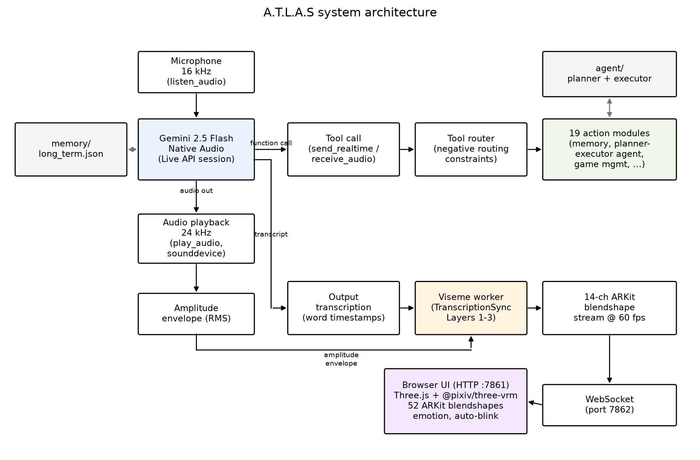
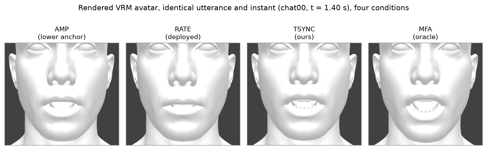
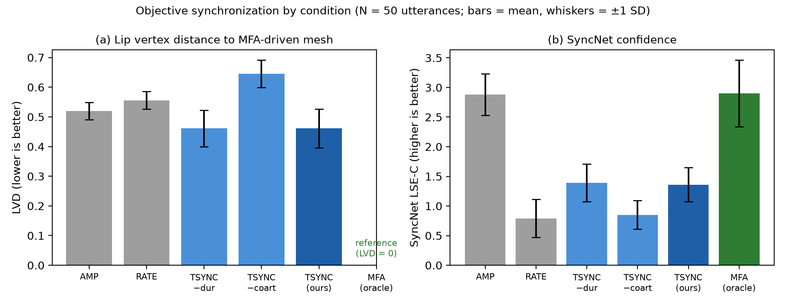
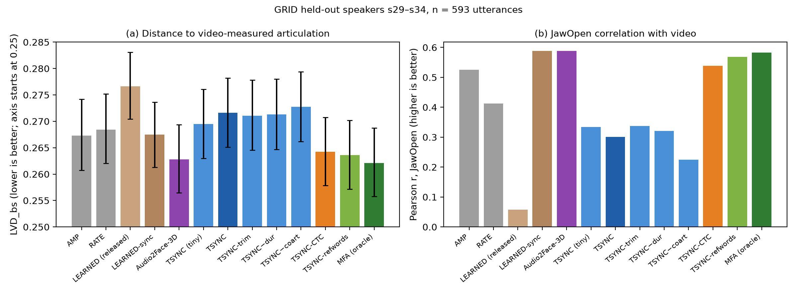
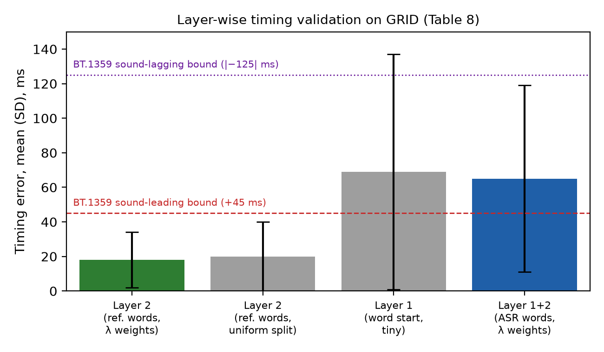
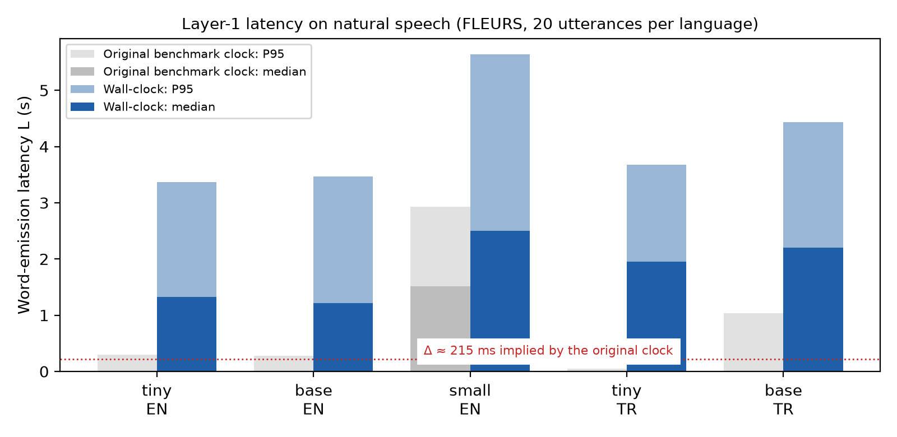
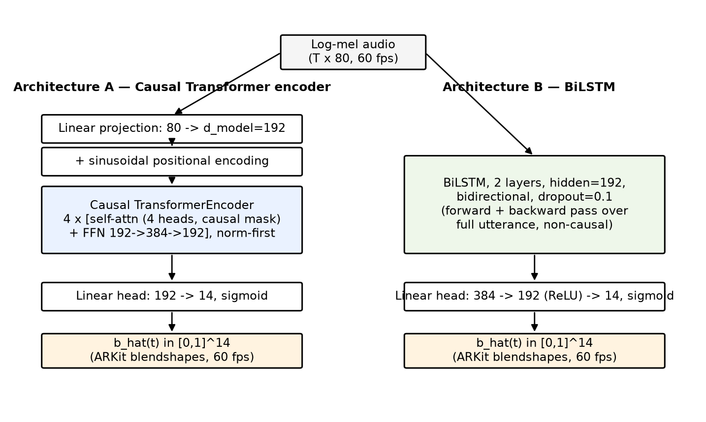
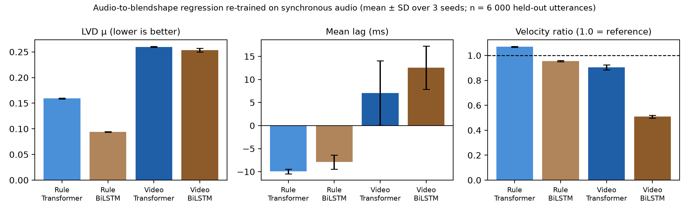
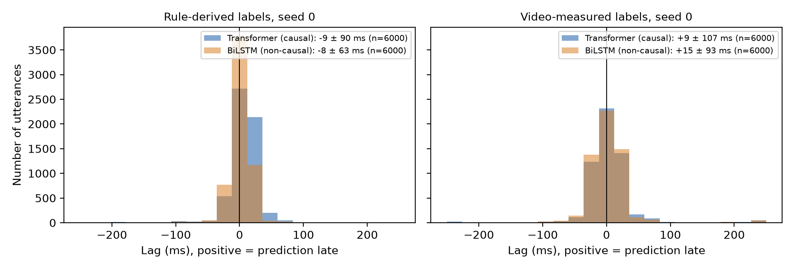

::: {custom-style="PaperTitle"}
TranscriptionSync: Training-Free Lip Synchronization for Native-Audio Large Language Models and a Layer-Wise Evaluation Against Video-Measured Articulation
:::

**Asst. Prof. Dr. Murat ARSLAN**¹

¹ Department of Software Engineering, Altınbaş Cyprus University, Cyprus

Corresponding author: Murat Arslan (e-mail: research@wpu.edu.tr).

::: {custom-style="SecHead"}
ABSTRACT
:::

Native-audio (speech-to-speech) large language models (LLMs) output raw PCM audio without phoneme timing, so lip-sync pipelines that read a synthesizer's phoneme schedule do not apply. We present TranscriptionSync, a training-free three-layer pipeline: word timing on the audio clock (Layer 1), phoneme durations within each word from articulatory-class weights (Layer 2), and 14 ARKit mouth blendshapes from kernel co-articulation with bilabial closure (Layer 3). We evaluate it layer by layer against video-measured articulation (593 held-out GRID utterances) and wall-clock latency. With a streaming Whisper recognizer as Layer 1, the pipeline falls behind amplitude-driven baselines and its P95 word-emission latency is about 3.4 s, although a benchmark clock omitting the window fill time reports 214 ms. An alignment variant instead aligns the transcript that the APIs stream ahead of the audio by streaming CTC forced alignment, at 45–56 ms per 160 ms hop on a CPU. Replaying the logged text timing of 50 Gemini Live responses, its P95 latency is 0.48 s and 89% of word starts fall within 100 ms of forced alignment (Turkish: 92%). On GRID, the pipeline outperforms amplitude-only and rate-scheduled animation in blendshape distance and JawOpen correlation, coming within about 0.5% of NVIDIA Audio2Face-3D in blendshape distance but behind it in mesh distance. SyncNet LSE-C/LSE-D are insensitive to ±200 ms offsets on stylized avatars, unlike SyncNet's bias-corrected offset estimate; the public GRID distribution pairs silence-trimmed audio with untrimmed alignments and mislabels speaker folders. TranscriptionSync is integrated into the A.T.L.A.S desktop assistant, which ships the rate-scheduled variant by default.

**INDEX TERMS** — ARKit blendshapes, embodied conversational agents, grapheme-to-phoneme conversion, large language models, lip synchronization, multimodal interaction, real-time facial animation, speech-to-speech models, viseme synthesis.

::: {custom-style="SecHead"}
I\. INTRODUCTION
:::

Intelligent personal assistants such as Amazon Alexa, Apple Siri and Google Assistant have made voice a mainstream interface modality, yet they remain disembodied: they are present only as synthesized speech, without a persistent visual agent that users can treat as a social co-presence {{porcheron,clark}}. Research over several decades shows that visual embodiment and expressivity increase engagement, memorability and trust compared with audio-only interfaces {{cassell,breazeal,li}}. Building such an agent for the desktop has traditionally required chaining automatic speech recognition (ASR), dialogue management, text-to-speech (TTS) and animation modules, which yields 1.5–3 s of latency per turn {{skantze}} and violates the sub-second turn-taking timing of natural conversation {{stivers}}. A recent class of speech-to-speech large language models (LLMs), exemplified by the OpenAI GPT-4o Realtime API and the Google Gemini Live API {{gpt4o,gemini}}, consolidates these stages into a single model that consumes and produces audio at sub-second conversational latency.

This creates a new opportunity for embodied assistants and a specific technical problem: native-audio models output raw PCM audio with no phoneme timing. Phoneme-driven lip-sync pipelines that read the synthesizer's phoneme schedule {{jali}} have no synthesizer to query, and offline forced alignment of the output audio {{mfa}} is non-causal. Learned audio-driven facial animation {{taylor,karras,faceformer}} operates on raw audio and has recently become streaming-capable and lightweight {{a2f3d,streamingtalker,telepresence,echoavatar,tinyv2f}}; NVIDIA Audio2Face-3D, for example, now ships open weights and outputs ARKit blendshapes {{a2f3d}}. Commercial SDKs that add visemes to native-audio APIs {{agora,mascot}} publish neither their method nor an evaluation.

This paper studies a training-free alternative, TranscriptionSync, and asks where such a pipeline stands against learned models when all are measured against real articulation. Its premise is that what is being said can be recovered: a lightweight speech recognizer supplies words and approximate word timing from the output audio or, better, the API's own transcript is aligned to the audio, and the remaining task is to place phonemes inside known word boundaries. The appeal is that the pipeline needs no training data, is interpretable phoneme by phoneme, extends to a new language through a grapheme-to-phoneme converter, and costs almost nothing once word timing is available. The contributions are:

1.  *The TranscriptionSync pipeline* (Section IV): streaming word timing behind a playout buffer, obtained either by recognition or by streaming CTC alignment of the API's own transcription, word-bounded phoneme duration estimation with non-accumulating error, and 60 fps kernel co-articulated synthesis of 14 ARKit mouth blendshapes with bilabial closure dominance, integrated into the A.T.L.A.S desktop assistant (Section III).

2.  *A layer-wise evaluation against video-measured articulation* (Section V-D): on 593 held-out GRID utterances with MediaPipe ARKit ground truth, we compare amplitude-only, rate-scheduled and learned baselines, including Audio2Face-3D, with TranscriptionSync and its ablations. We show that Layers 2–3 reach the accuracy of Audio2Face-3D given accurate word boundaries, that a streaming recognizer is what limits the complete pipeline, and that streaming alignment of the transcript removes most of that limit.

3.  *Wall-clock latency of Layer 1* (Section V-F): we identify a clock-origin error that makes sliding-window benchmarks report sub-300 ms latencies, show that sliding-window Whisper finalization yields a P95 word-emission latency of about 3.4 s on natural speech, and show that streaming CTC alignment of the known transcript reduces it to 0.56–0.68 s for English on a CPU (in a simulator that replays logged Live API timing), which makes the complete pipeline both real-time and more accurate than the simple baselines in blendshape distance and JawOpen correlation.

4.  *Measurement pitfalls and their corrections*: an oracle that shares the evaluated representation inflates geometric agreement (Sections V-C and V-D); SyncNet's LSE-C/LSE-D are offset-invariant on stylized avatars while its offset estimate remains valid after bias correction (Section V-C); the public GRID distribution pairs silence-trimmed audio with untrimmed alignments and mislabels 22 of 34 alignment folders, which, left uncorrected, degrades learned audio-to-blendshape models (Sections V-E and V-G).

Section II reviews related work, Section III describes the host system, Section IV presents the lip-sync method, Section V reports the objective evaluation, Section VI discusses implications, limitations and future work, and Section VII concludes.

::: {custom-style="SecHead"}
II\. RELATED WORK
:::

*A. Voice-Based Personal Assistants.* Commercial voice assistants have developed rapidly since Siri (2011) and the Amazon Echo (2014). An ethnographic study of smart speakers by Porcheron et al. found that users treat these devices as peripheral tools rather than social actors {{porcheron}}. Clark et al. identified the absence of contextually relevant visual information as a structural constraint on the complexity of tasks performed by voice {{clark}}, and Kiseleva et al. highlighted user-satisfaction factors of intelligent assistants that extend beyond task completion {{kiseleva}}.

*B. Embodied Conversational Agents and Social Robots.* Cassell et al. showed that agents using gesture, gaze and facial expression are perceived as more natural and engaging than voice- or text-only counterparts {{cassell}}. Breazeal emphasized facial expressiveness for conveying attention and emotional state in sociable robots {{breazeal}}. Later surveys and experiments reported a moderate positive effect of embodiment on trust and rapport {{li,lee}}. The engineering cost of real-time animation, and lip synchronization in particular, remains a persistent obstacle; it is the part of the problem this paper addresses.

*C. Large Language Models and Native-Audio Interfaces.* Transformer-based LLMs {{vaswani}}, few-shot generalization {{brown}} and chain-of-thought reasoning {{wei}} have transformed conversational AI, and tool use enables language-driven orchestration of external functions {{toolformer}}. Park et al. demonstrated believable long-term agent behavior with LLM-supported memory {{park}}. Most relevant here are speech-to-speech architectures: GPT-4o is trained end-to-end across audio, vision and text {{gpt4o}}, and the Gemini Live API provides bidirectional audio streaming with tool use and automatic transcription {{gemini}}. Published work on embodied systems driven by such APIs, and on animating avatars from their output, remains scarce.

*D. Lip Synchronization and Viseme Synthesis.* Lip-sync methods fall into three broad families.

(i) *Text/phoneme-driven methods* obtain a phoneme schedule from the TTS engine or from a forced aligner such as the Montreal Forced Aligner and map phonemes to visemes with co-articulation rules {{mfa,jali,fisher,cohen}}. They cannot be applied directly to native-audio LLMs: there is no synthesizer to query, and forced aligners are non-causal. Word-level timestamps from Whisper-family recognizers {{whisper,whisperx}} and CTC-based alignment {{ctcseg}} can supply timing, but their streaming, causal use for lip-sync has not been evaluated.

(ii) *Learned audio-driven methods* regress facial parameters or meshes from audio {{taylor,karras,voca,meshtalk,faceformer,codetalker,selftalk,unitalker}}, including production systems such as NVIDIA Audio2Face-3D {{a2f3d}}, or generate video directly, as Wav2Lip does {{wav2lip}}. Recent work targets streaming operation explicitly: Audio2Face-3D processes audio in a streaming manner and outputs ARKit blendshape weights, with open weights and an SDK that includes a CPU fallback {{a2f3d}}; StreamingTalker generates 3D facial motion autoregressively at about 25 ms per step {{streamingtalker}}; Lee et al. animate photorealistic telepresence avatars from audio with under 15 ms of GPU time {{telepresence}}; EchoAvatar streams face and body motion in the ARKit schema for voice agents {{echoavatar}}; and Han et al. distil a teacher into convolutional student models of a few megabytes for low-resource devices {{tinyv2f}}. They operate on raw PCM and achieve impressive quality. Livatar-1 reaches 0.17 s end-to-end latency on a dedicated NVIDIA A10 {{livatar}}, and TalkingMachines serves autoregressive diffusion avatars on H100 clusters {{talkingmachines}}. Most of this family requires training data, most real-time systems target GPU inference, and many methods output video frames or dense meshes rather than rig parameters; the lightweight and CPU-capable members show, however, that learned streaming lip-sync is no longer restricted to GPU servers. A lightweight sub-family runs on the CPU: Oculus/Meta Lipsync predicts a set of visemes from audio with a learned model {{ovrlipsync}}, uLipSync matches MFCC features to calibrated viseme templates {{ulipsync}}, and Rhubarb Lip Sync recognizes phonetic content offline {{rhubarb}}. These tools are causal (except Rhubarb) and inexpensive, but they infer articulation from the local acoustic signal alone and, as far as we know, have not been evaluated against phoneme-timed articulation.

(iii) *Amplitude-based heuristics* open the mouth in proportion to signal energy. They are causal and cheap but carry no articulatory content, and they remain common in avatar integrations of streaming speech {{agora,mascot}}.

TranscriptionSync occupies a different point in this space. It recovers the articulatory detail of family (i) under streaming causality by re-deriving word-level timing with a lightweight streaming recognizer or, better, by aligning the API's own transcript to the audio, and estimating phoneme durations within those words. It needs no training and runs on a CPU budget. We evaluate it against family (iii), against a lightweight learned CPU model of family (ii), against NVIDIA Audio2Face-3D, and against a family-(i) oracle.

*E. Avatar Representation Standards.* A.T.L.A.S renders VRM avatars {{vrm}}, an open 3D humanoid format based on glTF, using Three.js and the @pixiv/three-vrm library {{threevrm}}. Facial animation follows Apple's ARKit specification of 52 blendshapes {{arkit}}, which is widely supported by game engines and avatar tools.

::: {custom-style="SecHead"}
III\. HOST SYSTEM: THE A.T.L.A.S ASSISTANT
:::

This section summarizes the assistant into which TranscriptionSync is integrated, as far as it matters for lip synchronization.

**A. Overview**

A.T.L.A.S is built around an asynchronous event loop (Python asyncio) that maintains a bidirectional session with the Gemini Live API (Figure 1): concurrent coroutines handle audio uplink, microphone capture, server events and playback, and the avatar runs in a browser window connected by a WebSocket.

{width="6.27in"}

::: {custom-style="CaptionText"}
**FIGURE 1.** System architecture. The Live API session (Gemini 2.5 Flash Native Audio) consumes 16 kHz microphone audio and produces 24 kHz response audio, function calls and an output transcription. Response audio is played through sounddevice, which also provides the RMS amplitude envelope for the fallback articulation channel. Function calls are routed, subject to negative routing constraints, to 19 action modules that include the persistent memory store and the planner–executor agent. The viseme worker (TranscriptionSync Layers 1–3, or the RATE variant in the default configuration) generates a 14-channel ARKit blendshape stream (TSYNC: 60 fps; RATE: one pose per character, ≈13 Hz). The blendshape stream and amplitude envelope are sent over a WebSocket (port 7862) to the web UI (HTTP port 7861), which animates the ARKit blendshapes, emotion state and automatic blinking on the VRM avatar with Three.js and @pixiv/three-vrm.
:::

::: {custom-style="CaptionText"}
**TABLE 1.** Audio pipeline configuration.
:::

| **Parameter** | **Value** | **Rationale** |
|---|---|---|
| Uplink sample rate | 16 000 Hz, mono, int16 | Live API input format |
| Downlink sample rate | 24 000 Hz, mono, int16 | Live API output format |
| Input block size | 1 024 samples (64 ms) | fine-grained voice-activity gating |
| Output block size | 8 192 samples (341 ms) | prevents playback underruns |
| Uplink queue depth | 10 blocks (drop-oldest) | bounds stale-audio latency |
| LLM | gemini-2.5-flash-native-audio | speech-to-speech, tool use |
| Planner LLM | gemini-2.5-flash-lite | low-cost JSON plan generation |

**B. Audio Pipeline**

Microphone audio is captured in 64 ms blocks. To prevent self-echo, transmission is suppressed while the assistant is speaking (software half-duplex over a full-duplex transport). A user-triggered 2 s calibration records the RMS energy of each block,

::: {custom-style="Equation"}
*r = √( (1/N) Σᵢ xᵢ² ),  xᵢ ∈ [−1, 1),  N = 1024,*  (1)
:::

and sets the noise-gate threshold from the mean μ and standard deviation σ of the collected values,

::: {custom-style="Equation"}
*θ = clamp( μ + 2σ, 0.005, 0.02 );*  (2)
:::

blocks with *r* < θ are not transmitted. A drop-oldest uplink queue of 10 blocks bounds audio staleness at about 640 ms (Table 1).

**C. Tools, Agent and Memory**

The Live API session returns audio together with an output transcription, which TranscriptionSync and the RATE variant consume. The model can call 19 functions (Table 2); calls run on a thread pool so that they never block the audio loop, and tool descriptions carry negative routing constraints that reduced tool-selection errors in informal testing.

::: {custom-style="CaptionText"}
**TABLE 2.** The 19-tool automation layer.
:::

| **Category** | **Tools** | **Backend** |
|---|---|---|
| Application & OS control | open_app, computer_settings, computer_control, desktop_control | OS APIs, PyAutoGUI |
| Web & information | web_search, browser_control, weather_report, flight_finder, youtube_video | browser automation, public APIs |
| Communication | send_message, reminder | messaging platforms, task scheduler |
| Files | file_controller | filesystem API |
| Vision | screen_process | screen/webcam capture + vision LLM |
| Software development | code_helper, dev_agent | code generation + execution |
| Gaming | game_updater | Steam/Epic launchers |
| Meta | agent_task, save_memory, shutdown_atlas | planner–executor, memory store |

Multi-step goals are delegated to a planner–executor agent: a lightweight LLM (gemini-2.5-flash-lite) returns a strict-JSON plan of at most five steps, the executor runs them sequentially and re-plans a bounded number of times when a critical step fails, and tasks run on a background priority queue so that the voice interface stays responsive. Long-term memory is a six-category JSON store capped at 2 200 characters (about 550 tokens) with least-recently-updated eviction, injected into the system prompt at session start.

**D. Avatar and Emotion Layer**

The browser client renders VRoid VRM models with Three.js and @pixiv/three-vrm, which expose the full 52-blendshape ARKit set. Each frame combines an idle/speaking body state machine, the 14 mouth blendshapes streamed from the core process (Section IV), an emotion layer restricted to upper-face channels while the avatar speaks, and stochastic blinking. When an avatar client is connected, response audio is delivered together with its blendshape schedule and played in the browser, so audio and visemes share one clock at the destination.

Because the native-audio model provides no affect metadata, the displayed emotion is derived from the output transcription by a rule-based classifier with bilingual keyword dictionaries. Playback of the first audio chunk is held back briefly (≤ 650 ms) so that the expression is set before speech begins; this hold-back is part of the end-to-end latency budget (unmeasured; Section VI-B).

::: {custom-style="SecHead"}
IV\. TRANSCRIPTIONSYNC: WORD-TIMESTAMP-DRIVEN VISEME SYNTHESIS
:::

**A. Problem Statement**

The native-audio model produces, for each response, a sequence of 24 kHz PCM chunks a₁, a₂, …. It may also emit an asynchronous stream of transcription text chunks without timestamps and with an unknown offset relative to the audio (for Gemini Live, the text leads; Section IV-B). The API provides no phoneme labels, positions or durations. The objective is to drive M = 14 mouth blendshape channels b(t) ∈ [0,1]^M at 60 Hz so that articulation is plausible and synchronized with the audio, causally and in real time on a CPU.

Amplitude-only approaches set jaw aperture from short-term energy. They are synchronous but carry no articulation: no lip closure for /m, b, p/, no rounding for /u, o/ and no spreading for /i, e/. Offline forced alignment (e.g., MFA) recovers accurate phoneme timing but needs the entire utterance and 10²–10³ ms of computation. TranscriptionSync divides the problem into three stages: inexpensive recovery of word-level timing (Layer 1), estimation of phoneme timing within the recovered words (Layer 2), and synthesis of co-articulated blendshape trajectories from the timed phonemes (Layer 3).

**B. Layer 1: Streaming Word Timing with Playout-Buffer Synchronization**

Layer 1 has two variants. In the *recognition* variant (TSYNC-ASR), incoming PCM chunks are appended to a rolling buffer and transcribed incrementally by an int8-quantized multilingual Whisper model on the CPU {{whisper,whisperstreaming}} with word-level timestamps. Inference runs on a window of W = 3.2 s with hop h = 320 ms. A word wᵢ is finalized once its end time tᵢᵉ lies more than a guard interval g behind the buffer head; it is then emitted as the triple (textᵢ, tᵢˢ, tᵢᵉ) and not refined further. Substitution errors are partly tolerated: they tend to replace a word with a phonetically similar one, whose visemes are also similar, which is consistent with the gradual degradation observed in the layer-wise experiments (Section V-E).

Whisper-family models tie their decoding clock to the onset of speech. When a window begins with silence, word timestamps are shifted by an amount related to the leading silence, which appears directly as audio-visual desynchronization. The remedy is energy-based onset detection: the window is trimmed at the first sustained above-threshold RMS frame (minus an 80 ms margin), transcribed, and the trimmed offset is added back so that emitted timestamps refer to the stream clock. This correction is used in the GRID layer-wise validation (Section V-E), but the TSYNC (small) configuration of Tables 4 and 6 does not apply it. On GRID audio with natural leading silence, adding it reduces the word-start error of the streaming recognizer from 169 to 90 ms (Section V-D), so it should be considered part of Layer 1.

In the *alignment* variant (TSYNC-CTC), Layer 1 does not recognize words at all. Native-audio APIs stream a text transcription of the response alongside the audio; for Gemini Live, the first transcription chunk arrives a mean 690 ms before the first audio chunk (50 responses, Section V-C), and further words follow at roughly speaking rate. Layer 1 then only has to place known words on the audio clock, which is a streaming forced-alignment problem. Every hop (h = 160 ms; 320 ms for MMS on the CPU), a compact CTC acoustic model (wav2vec2-base fine-tuned for English character recognition, 94 M parameters {{w2v2}}; the multilingual MMS aligner, 315 M parameters {{mms}}, for other languages) computes character posteriors for the audio since the last committed word (plus a 300 ms left margin), and a free-end CTC Viterbi pass aligns the next words of the transcript to them, so that the best-scoring *prefix* of the remaining text is placed. A word is committed when its aligned end lies at least a guard g = 100 ms behind the buffer head and either the next word has started or the path has remained in the blank state after it for at least 200 ms (pause rule); at the end of the stream all remaining words are flushed. Committed boundaries are never revised, and the next alignment starts from the last committed word end, which keeps the per-hop cost bounded.

Let L denote the word-emission latency of Layer 1: the time between the moment the last sample of a word enters the buffer and the moment its triple is emitted, measured in wall-clock time and including recognizer compute. The key architectural component is the playout buffer. The avatar client (Section III-D) receives and renders the response audio with a delay Δ, so an audio sample with stream time t is presented at wall time t + Δ. The viseme pipeline has Δ of guaranteed headroom, and synchronization is limited only by timestamp accuracy, not by pipeline latency, provided that

::: {custom-style="Equation"}
Δ ≥ P95(L) + L_g2p + L_syn,  (3)
:::

where L_g2p and L_syn are the (sub-millisecond) latencies of Layers 2 and 3. Δ is the single user-tunable parameter: it increases voice-to-voice response time but does not by itself introduce desynchronization. Equation (3) presupposes that the recognizer keeps up with the stream on average, that is, that per-window compute does not exceed the hop h. Otherwise L grows without bound and no finite Δ suffices, unless the recognizer skips ahead to the most recent audio, as our implementation does (Section V-F). The playout buffer hides *latency*; it does not correct *errors* in the timestamps themselves, which reach the viewer as audio-visual offset.

**C. Layer 2: G2P Conversion and Word-Bounded Phoneme Duration Estimation**

Each finalized word is converted to its phoneme sequence p₁ … p_J by grapheme-to-phoneme (G2P) conversion: for English, a neural G2P model based on CMUdict; for Turkish, a rule-based converter that exploits the language's near one-to-one grapheme–phoneme correspondence (shallow orthography). Layer 2 then assigns each phoneme a duration within the known word interval Tᵢ = tᵢᵉ − tᵢˢ.

Equal division (d_j = Tᵢ / J) ignores the systematic duration differences between phoneme classes; vowels, for instance, are typically about twice as long as stops in natural speech. We therefore assign durations in proportion to articulatory-class weights λ:

::: {custom-style="Equation"}
*d_j = Tᵢ · λ(p_j) / Σ_{k=1..J} λ(p_k),*  (4)
:::

with fixed design weights: vowel 1.6, diphthong 2.1, fricative 1.0, affricate 0.9, nasal 0.9, plosive 0.7, liquid 0.8, glide 0.75, set from phonetic duration norms. These are design constants, not fitted to any corpus; Section V-E evaluates them unchanged against forced alignment on held-out GRID speakers. Phoneme midpoints follow as

::: {custom-style="Equation"}
*τ_j = tᵢˢ + Σ_{k<j} d_k + d_j / 2.*  (5)
:::

The main property of this formulation is that timing error is bounded and does not accumulate. Every phoneme is placed relative to the boundaries of its own word, so its error is bounded by the word length plus the recognizer's boundary error ε: |τ̂_j − τ_j| < Tᵢ + ε, where Tᵢ is usually below 400 ms. The bound is re-initialized at every word boundary. Unlike free-running schedules, including the one in Section IV-F, there is no unbounded drift between anchors. Against forced alignment, the mean phoneme-midpoint error is 18 ms with reference word boundaries and 65 ms end-to-end with a compact streaming recognizer (Section V-E). Inter-word pauses in the timestamp stream (t_{i+1}ˢ − tᵢᵉ above a threshold) are rendered as a light lip-closure pose.

**D. Layer 3: Kernel Co-Articulated ARKit Viseme Synthesis**

Each phoneme class maps through a table V: p ↦ V(p) ∈ [0,1]^M of target intensities over the 14 ARKit mouth channels (JawOpen, MouthClose, MouthFunnel, MouthPucker, MouthStretchL/R, MouthUpperUpL/R, MouthLowerDownL/R, MouthShrugUpper, MouthRollLower, MouthDimpleL/R). The table extends the grapheme-class table of the RATE variant to the full ARPAbet and Turkish phoneme inventories; the complete table is released with the source code (Appendix A). Table 3 lists representative entries.

::: {custom-style="CaptionText"}
**TABLE 3.** Representative phoneme-class → ARKit viseme targets (excerpt; full table in the released source).
:::

| **Class** | **Examples** | **Dominant targets** |
|---|---|---|
| Open vowel | AA, AE / a | JawOpen 0.60, MouthLowerDown 0.35 |
| Spread vowel | IY, EH / i, e | MouthStretch 0.42–0.52, JawOpen 0.18–0.32 |
| Rounded vowel | OW, UW / o, u, ö, ü | MouthPucker 0.18–0.58, MouthFunnel 0.38–0.42 |
| Bilabial | M, B, P | MouthClose 0.65–0.92, JawOpen ≤ 0.04 |
| Labiodental | F, V | MouthUpperUp 0.48–0.58, JawOpen ≤ 0.08 |
| Sibilant | S, Z, SH / s, z, ş | MouthStretch 0.22–0.28, JawOpen ≤ 0.10 |
| Inter-word gap | — | MouthClose 0.28, JawOpen 0.04 |
| Default consonant | other | JawOpen 0.12, MouthShrugUpper 0.08 |

Frames are synthesized at 60 fps by normalized Gaussian-kernel regression over the train of timed phoneme targets, a continuous co-articulation model in the spirit of Cohen–Massaro dominance functions {{cohen}}:

::: {custom-style="Equation"}
*b_k(t) = Σ_j V_k(p_j) · K_σ(t − τ_j) / max(ε, Σ_j K_σ(t − τ_j)),  K_σ(u) = exp(−u² / 2σ²),*  (6)
:::

with σ = 30 ms controlling co-articulatory overlap. Each frame is a kernel-weighted blend of the phoneme targets within ±3σ, so adjacent visemes merge smoothly instead of snapping. Truncating the kernel support keeps the per-frame cost at O(M · J_local) with J_local ≤ 5. Phoneme duration enters Eq. (6) only through the midpoints τ_j; the kernel width is the same for all phonemes.

Plain kernel averaging has one perceptually serious flaw: brief bilabial closures (/m, b, p/) are averaged away by their open-mouthed neighbors, although they are among the events viewers watch most closely. A *closure-dominance rule* therefore overrides Eq. (6) for the MouthClose channel,

::: {custom-style="Equation"}
*b_close(t) = max_j { V_close(p_j) · K_σ(t − τ_j) : p_j ∈ bilabial },*  (7)
:::

a winner-take-all within the kernel support that guarantees visible lip contact at every bilabial event. Whenever a bilabial lies within the kernel support, the JawOpen channel is suppressed reciprocally, b_jaw(t) ← b_jaw(t) · (1 − b_close(t)). The resulting 14-channel frames are streamed with the audio to the avatar client, which presents both on the common playout clock (Section IV-B). At the end of the turn, the channels decay to the neutral closure pose so that the mouth never remains open after speech.

**E. Latency Budget and Complexity**

Layers 2 and 3 are computationally negligible: G2P is a dictionary or rule lookup, and frame synthesis costs O(M · J_local), about 0.05 ms per frame and 0.3% of one CPU core in total (Section V-F). The latency and compute budget is therefore set by Layer 1. With sliding-window Whisper recognition (W = 3.2 s, h = 320 ms, g = 400 ms), per-window compute is a few hundred milliseconds for the tiny and base models and on English exceeds the hop (Table 9), so the recognizer occupies a full core and keeps up only by skipping ahead; the word-emission latency measured in wall-clock time has a P95 of about 3.4 s on natural speech (Section V-F), so Eq. (3) requires Δ ≈ 3.4 s. This makes the finalization policy of the recognition variant, rather than recognizer size, the component to improve. The alignment variant avoids it: with the transcript known, a CTC aligner costs 45–56 ms per 160 ms hop on the CPU and emits words with a P95 latency of 0.56–0.68 s on English speech (Section V-F), so Eq. (3) is satisfied with Δ ≈ 0.7 s for English; for Turkish, Δ ≈ 1.2 s on the CPU or ≈ 0.8 s on a GPU.

**F. Deployed Lightweight Variant (RATE)**

Without the streaming recognizer, A.T.L.A.S runs a production variant that uses the API's untimed output transcription. This is the default configuration of the shipped system, and it is available in the project repository as the package transcription-sync (Appendix A). Letters of the transcription stream are consumed at a fixed articulation rate of ρ = 13 characters/s (≈150 words/min) and mapped through a grapheme-class viseme table (released; Table 3 lists the corresponding phoneme classes); spaces and punctuation render the inter-word closure pose. Each target pose is scaled by the audio amplitude: the RMS of each PCM chunk is compressed as E = min(0.42, 1.9 · RMS^0.55), smoothed by an asymmetric follower (attack 0.50, release 0.18), and applied as the gain g = min(1.4, 2.2 · E). When a pose does not specify MouthClose, a light rest closure max(0, 0.08 − 0.2 · JawOpen) is added. Poses are then smoothed per channel by a first-order filter (β = 0.40) applied once per character, that is, at the 13 Hz character cadence. In the live system the character clock starts when the first transcription chunk arrives, which precedes the audio by a mean 690 ms (n = 50 re-collected responses, Section V-C; an earlier in-app measurement over n = 7 turns gave 349 ms); the offline port used in Section V aligns it to the audio onset instead. The variant is training-free, ASR-free and adds no latency, but its timing is open-loop: articulation shapes and audio are coupled only through signal energy, and the character cadence is not re-anchored to the audio.

::: {custom-style="SecHead"}
V\. OBJECTIVE EVALUATION
:::

**A. Conditions**

All conditions drive the identical evaluation avatar with the identical audio. The evaluation avatar is an untextured glTF humanoid head with ARKit morph targets (human.glb), rendered with the same Three.js stack as the A.T.L.A.S client; it is not the VRoid VRM model used in the deployed UI.

- **AMP (lower anchor).** Amplitude-only articulation: JawOpen follows a smoothed RMS envelope, and all other channels stay at rest. This reproduces the amplitude-driven integrations common for native-audio streams {{agora,mascot}}.

- **RATE (deployed variant).** The rate-scheduled, amplitude-resynchronized variant of Section IV-F, the strongest training-free method available without word timing and the default in A.T.L.A.S.

- **LEARNED (learned CPU baseline, Section V-D only).** The causal audio-to-ARKit Transformer of Section V-G (Architecture A, 1.21 M parameters, released checkpoint trained on GRID s1–s28 with offset audio and rule-derived labels; Section V-G), run on the CPU. It represents the lightweight learned sub-family of Section II-D(ii). Oculus/Meta Lipsync and uLipSync, the other members of that sub-family, are distributed only as Unity/native plug-ins for Windows, macOS and mobile targets and could not be run in our Linux evaluation pipeline. LEARNED is evaluated on GRID (Section V-D) and not in Table 4.

- **TSYNC (proposed).** The full TranscriptionSync pipeline of Sections IV-B–IV-D. Without a suffix, TSYNC denotes the recognition variant with the Whisper small recognizer (TSYNC-ASR-small), the configuration of the original evaluation.

- **MFA (upper anchor, non-causal oracle).** The complete utterance audio and reference transcript are aligned offline with the Montreal Forced Aligner {{mfa}}, and the aligned phoneme timestamps drive the same viseme table and kernel synthesis (Eqs. (6)–(7) with estimated timing replaced by aligned timing). This bounds what any causal method could achieve *with the same viseme representation*, at the cost of non-causality.

Two ablations of TSYNC isolate the Layer-2 and Layer-3 mechanisms: **TSYNC−dur** (uniform within-word durations, d_j = Tᵢ/J, replacing the class weights of Eq. (4)) and **TSYNC−coart** (nearest-phoneme step targets replacing the kernel regression of Eq. (6)). Sections V-C and V-D add further conditions: LEARNED-sync, Audio2Face-3D, TSYNC-ASR (tiny, onset-corrected), TSYNC-trim, TSYNC-refwords and TSYNC-CTC.

**B. Test Material and Metrics**

We collected N = 50 English responses from the same Gemini Live model, voice and persona as the deployed system (gemini-2.5-flash-native-audio-latest, prebuilt voice "Charon") across five task categories (chat, how-to, question answering, summary, task; ten each). Responses were elicited with text prompts; the audio is the model's native 24 kHz output stream, exactly as the live client receives it. Mean utterance duration is 15.6 s (≈ 778 s in total). Each condition was generated offline on the recorded audio. TSYNC used the streaming simulator of make_conditions.py with an idealized hop (the window advances by exactly h regardless of compute) and the Whisper *small* int8 model, which is the script default; the latency figures of Section V-F refer to the *tiny* model. This TSYNC configuration is therefore idealized: with small, per-window compute exceeds the hop, so it is not real-time on our CPU (Table 9). The reference transcript for the MFA oracle and the RATE condition is the Live API output transcription, unedited, as the live system would receive it. Each condition was rendered at 1080p/60 fps with frame-accurate audio multiplexing (six conditions × 50 utterances = 300 videos) and downscaled to 640×480/25 fps, the SyncNet input format. Figure 2 shows one utterance rendered under the four anchor conditions at the same instant. The avatar is an untextured mesh without skin texture, lip color, teeth texture or eye texture, which is stylistically far from the natural face video used to train SyncNet.

Metrics. (i) *SyncNet* {{syncnet}}, pretrained, applied to the rendered videos, with the standard talking-head metrics {{wav2lip}}: lip-sync error distance (LSE-D; lower is better) and lip-sync confidence (LSE-C; higher is better). (ii) *Lip vertex distance (LVD)*: the mean per-frame L2 distance between the 400 most morph-affected lip-region vertices of the evaluation mesh and those of the mesh driven by the MFA oracle, in normalized model units; MFA has LVD = 0 by definition. Tables 4 and 6 label this quantity LVD_oracle. LVD measures proximity to the oracle *within the TSYNC viseme representation*. Conditions that share Layer 3 with the oracle (TSYNC, TSYNC−dur) are structurally closer to it than conditions with a different articulation model (AMP, RATE, TSYNC−coart). We therefore interpret LVD as timing fidelity under a fixed representation, and validate the representation itself against video-measured articulation in Section V-D. (iii) *Word-start timing error* for phoneme-timed conditions: the mean absolute deviation of word start times from forced alignment over content-matched tokens. (iv) *Audio-visual lag*: the lag that maximizes the cross-correlation between the rendered mouth-opening signal and the audio envelope. We use the detectability thresholds of ITU-R BT.1359, +45 ms for sound leading vision and −125 ms for sound lagging vision {{bt1359}}. Negative lag values below denote visemes leading the audio (sound lagging vision).

Statistical analysis. Pairwise contrasts against TSYNC on LVD and lag use two-sided Wilcoxon signed-rank tests paired by utterance (n = 50), Holm-corrected across the family of contrasts. We report rank-biserial effect sizes r and percentile-bootstrap 95% confidence intervals (10 000 resamples) on paired mean differences. LSE-D/LSE-C contrasts are paired over the utterances for which both conditions yielded a SyncNet score (n = 45).

{width="6.0in"}

::: {custom-style="CaptionText"}
**FIGURE 2.** The evaluation avatar (untextured glTF head, human.glb) used for the objective evaluation, shown for one recorded utterance (chat00) at a single instant (t = 1.40 s) under the four anchor conditions (AMP, RATE, TSYNC, MFA). All scored videos drive this same untextured humanoid mesh with identical audio; only the mouth-region blendshape trajectory differs. The matte, texture-free surface (no skin detail, lip color or eye texture) is a stylization that SyncNet, trained on natural face video {{syncnet}}, was not designed for; Section V-C examines the consequences.
:::

**C. Synchronization Results on Live-System Utterances**

::: {custom-style="CaptionText"}
**TABLE 4.** Objective synchronization by condition; mean (SD) over N = 50 utterances. SyncNet face detection succeeded on 45–46 of 50 renders per condition; renders without a score are excluded from LSE-D/LSE-C. LVD_oracle: lip vertex distance to the MFA-driven mesh, which shares TSYNC's viseme representation (Section V-B). LVD_oracle and lag are computed on all 50. Timing err. is the word-start MAE against MFA over content-matched tokens (Section V-E convention: recognizer insertions and deletions are discarded, not paired by position). Negative lag = visemes lead audio. Significance, effect sizes and bootstrap CIs are given in the text.
:::

| **Condition** | **LSE-D ↓** | **LSE-C ↑** | **LVD_oracle ↓** | **Timing err. (ms)** | **Lag (ms)** |
|---|---|---|---|---|---|
| AMP (lower) | 11.66 (0.39) | 2.88 (0.35) | 0.520 (0.029) | — | 0.0 (0.0) |
| RATE (deployed) | 13.49 (0.41) | 0.79 (0.32) | 0.556 (0.030) | — | 91.0 (31.1) |
| TSYNC−dur | 13.14 (0.39) | 1.39 (0.32) | 0.461 (0.062) | 86 (18) | −42.7 (84.4) |
| TSYNC−coart | 13.29 (0.37) | 0.85 (0.24) | 0.645 (0.046) | 86 (18) | −109.3 (30.4) |
| **TSYNC (ours)** | 13.15 (0.36) | 1.36 (0.29) | **0.461 (0.065)** | 86 (18) | −52.7 (31.0) |
| MFA (oracle) | 11.70 (0.54) | 2.90 (0.56) | 0 (reference) | 0 | 15.7 (27.2) |

{width="6.0in"}

::: {custom-style="CaptionText"}
**FIGURE 3.** Objective synchronization by condition (Table 4); bars show means and whiskers ±1 SD. (a) LVD to the MFA-driven mesh (lower is better). TSYNC and TSYNC−dur have the lowest LVD; removing kernel co-articulation (TSYNC−coart) gives the highest. MFA is the reference (LVD = 0). (b) SyncNet confidence (LSE-C, higher is better). AMP and MFA score highest and almost identically, while RATE and the TSYNC variants cluster lower, so SyncNet does not reproduce the LVD ordering (Section V-C).
:::

**LVD favors TSYNC and isolates co-articulation as the source, within the shared representation.** TSYNC and TSYNC−dur have the lowest LVD (0.461; 95% CI [0.443, 0.479]), closer to the MFA-oracle trajectory than AMP (0.520) or RATE (0.556). Both contrasts are significant with large effects (TSYNC vs. AMP: paired Δ = −0.059, 95% CI [−0.078, −0.041], Holm-corrected p < 10⁻⁶, r = 0.79; TSYNC vs. RATE: Δ = −0.095 [−0.114, −0.075], p < 10⁻¹¹, r = 0.95). TSYNC−coart is the worst condition (0.645), well above AMP. TSYNC and TSYNC−dur are statistically indistinguishable (Δ = 0.000, 95% CI [−0.005, +0.005], p = 0.97, r = 0.01), so the class-weighted durations of Eq. (4) contribute negligibly to LVD on this material. Removing kernel co-articulation increases LVD by 40% relative to TSYNC (Δ = +0.184 [+0.167, +0.200], p < 10⁻¹⁴, r = 1.00, paired d_z = 3.1), the largest effect among all contrasts.

This comparison must be read with the construction of LVD in mind. The oracle itself is rendered with the kernel of Eq. (6), so any condition that shares that kernel is advantaged. The TSYNC−coart result therefore shows that, *given the kernel representation*, correct timing alone does not bring a step-target renderer close to the oracle; it does not by itself show that kernel co-articulation is closer to real human articulation. Section V-D tests that question against video-measured ground truth.

**Lag: TSYNC leads the audio by about 50 ms, within the tolerant side of the detectability window.** AMP has zero lag by construction, because its JawOpen channel *is* the audio envelope. MFA is almost aligned (15.7 ms). TSYNC (−52.7 ms) and TSYNC−dur (−42.7 ms) lead the audio by roughly 40–55 ms, which is smaller in magnitude than RATE's +91.0 ms lag and TSYNC−coart's −109.3 ms. TSYNC's absolute lag is significantly smaller than RATE's (paired Δ|lag| = −38 ms, 95% CI [−48, −29], p < 10⁻⁷, r = 0.94) and TSYNC−coart's (Δ|lag| = −57 ms [−62, −50], p < 10⁻⁹). A visual lead of about 50 ms corresponds to sound lagging vision and lies inside the −125 ms detectability threshold of BT.1359 {{bt1359}}, whereas RATE's +91 ms visual lag (sound leading) exceeds the +45 ms threshold. TSYNC−coart shares TSYNC's timing but differs in lag by 57 ms, which shows that the cross-correlation lag also depends on the *shape* of the mouth-opening trajectory, not only on timing. We therefore use lag as a coarse indicator and word-start error as the timing measure.

**SyncNet does not reproduce the LVD ranking; a validity analysis shows it is unsuitable for this avatar.** AMP and MFA score almost identically and best (LSE-D ≈ 11.7, LSE-C ≈ 2.9), while RATE and all TSYNC variants score worse (LSE-D ≈ 13.1–13.5, LSE-C ≈ 0.8–1.4). Both AMP and MFA are significantly better than TSYNC on LSE-D (paired p < 10⁻⁸ and p < 10⁻¹³). Within the lower-scoring group, TSYNC's LSE-D is marginally but significantly below RATE's (13.15 vs. 13.49, p < 10⁻⁴), but this 0.34-unit gap is small against the ≈ 1.5-unit deficit relative to AMP and MFA. Three observations indicate that LSE-D/LSE-C do not measure lip-sync quality on this avatar.

First, *absolute scores show a large domain gap*: even the forced-alignment oracle reaches only LSE-C ≈ 2.9, far below values typically reported for real talking-face video {{wav2lip}}.

Second, *SyncNet does not separate articulatorily empty motion from the oracle*. AMP, whose only moving channel is the audio envelope, is statistically indistinguishable from MFA on LSE-C (2.88 vs. 2.90; paired Δ 95% CI [−0.17, +0.12], p = 0.80) and LSE-D (11.66 vs. 11.70; [−0.19, +0.11], p = 0.67), yet is rated significantly higher than RATE and TSYNC (LSE-C, paired p < 10⁻⁸ and p < 10⁻¹³). A metric that ranks jaw-only motion at the top is not scoring articulatory fidelity.

Third, *its offset estimate is biased on this representation*. AMP is synchronous by construction, yet SyncNet estimates an audio-visual offset of +73 ms (95% CI [+69, +77], p = 2×10⁻¹⁰), with a similar ≈ +70 ms bias on MFA (p = 3×10⁻⁸), roughly two video frames of systematic error under exact synchronization. The SyncNet offset estimate tracks the mouth–audio lag of Table 4 with Pearson r = 0.40 (Spearman ρ = 0.69).

**Controlled SyncNet test.** To separate what SyncNet does and does not measure on this avatar, we rendered 20 FLEURS English utterances {{fleurs}} (natural read speech, mean 10.0 s; the same utterances as in Section V-F; independent of the evaluation material) with the AMP trajectory displaced by known offsets of −200 to +200 ms (nine offsets, 180 videos), plus RATE, TSYNC (small recognizer) and MFA at zero offset, and scored all 240 videos with the same SyncNet pipeline (Table 5).

::: {custom-style="CaptionText"}
**TABLE 5.** SyncNet on controlled displacements of the AMP trajectory (20 FLEURS-en utterances per row; five of the nine imposed shifts shown; positive shift = visemes late). Offset: SyncNet's estimated audio-visual offset, mean ± SD over utterances.
:::

| **Condition** | **Imposed shift (ms)** | **LSE-D** | **LSE-C** | **Estimated offset (ms)** |
|---|---|---|---|---|
| AMP | −200 | 10.10 | 2.09 | −144 ± 20 |
| AMP | −80 | 10.07 | 2.08 | −24 ± 20 |
| AMP | 0 | 10.09 | 2.10 | +58 ± 24 |
| AMP | +80 | 10.11 | 2.06 | +140 ± 24 |
| AMP | +200 | 10.16 | 2.07 | +258 ± 24 |
| RATE | 0 | 10.84 | 0.98 | +102 ± 187 |
| TSYNC | 0 | 11.70 | 0.96 | −8 ± 218 |
| MFA | 0 | 10.64 | 1.99 | +38 ± 121 |

Two properties follow. *LSE-C and LSE-D are insensitive to offset*: across ±200 ms of imposed displacement, LSE-C stays between 2.06 and 2.10 and LSE-D between 10.07 and 10.16. This is a consequence of their definition: both are evaluated at the best-matching offset within SyncNet's search window, so they measure how well mouth motion *can* be matched to the audio, not whether it *is* synchronized. *The offset estimate, in contrast, is a valid synchronization measure on this avatar after bias correction*: it tracks the imposed shift with slope 1.00 and Pearson r = 0.98 (n = 180), with a constant bias of +58 ms, consistent with the ≈ +70 ms bias found on the evaluation material. The weaker agreement with the envelope-based lag reported above (Pearson r = 0.40) is therefore attributable to the envelope lag, which depends on trajectory shape, rather than to SyncNet. For the phoneme-driven conditions the offset estimate is much noisier (SD 121–218 ms against 20–24 ms for AMP), reflecting their low confidence scores. The controlled test also reproduces the main observation on independent material: AMP and MFA are indistinguishable on LSE-C (2.10 vs. 1.99, p = 0.26, n = 20), and RATE and TSYNC score lower (0.98 and 0.96).

A plausible mechanism is that SyncNet's confidence responds mainly to a single dominant, audio-correlated jaw-opening signal. AMP provides this by definition, and MFA's JawOpen tracks true vowel aperture, whereas RATE and the TSYNC variants distribute activation over rounding, spreading and closure channels that a model trained on real lips may read as decorrelation. We therefore do not use LSE-D/LSE-C as quality measures for this untextured avatar and do not treat them as evidence for or against TSYNC; SyncNet's bias-corrected offset remains usable as a synchronization check for motion with a clear jaw component.

**Live timing accuracy is comparable to the GRID results.** The live word-start MAE against MFA, on content-matched tokens, is 86 ms (SD 18; median 89 ms; mean token-match rate 85%). The compute_metrics.py script, which is available in the project repository, pairs words by position instead, which yields 1 380.9 ms; content-matched scoring is implemented in live_pipeline.py (see the re-collected material below). This compares with a Layer-1 word-start MAE on GRID of 69 ms for the tiny recognizer (Section V-E, Table 8) and 90 ms for the small recognizer with onset correction (Section V-D), so the controlled-corpus timing result carries over to conversational live speech with moderate degradation. The error decomposes into a per-utterance constant offset (median −65 ms, visemes early; Section IV-B) and a 64 ms within-utterance residual. The playout buffer does not remove the constant offset, since it shifts audio and visemes together, and the offset is visible in the rendered lag of −52.7 ms. Because the offset is predominantly negative (visemes leading), it falls on the tolerant side of the BT.1359 window, and its median can be removed by a fixed compensation term added to Layer-1 timestamps. On GRID, such a compensation reduces the word-start MAE of the onset-corrected recognizer from 90 to 50 ms (Section V-D). On the re-collected live material below, compensating the global median offset lowers the word-start MAE of the Whisper small recognizer from 83 to 64 ms. The within-utterance residual is not removable in this way.

The measurement must use content-matched tokens: pairing predicted and reference words by sequence index, which is invalid under conversational ASR where a single insertion or deletion shifts every subsequent word, inflates the apparent MAE by more than an order of magnitude and reflects word-sequence misalignment rather than articulation timing.

**Re-collected live material.** Because the original 50 recordings are not part of the released material, we collected a new set with the same model, voice, persona and prompts (50 English responses, mean 15.7 ± 4.7 s, range 2.8–24.3 s, 2 216 words; plus 25 Turkish responses to translated prompts, mean 17.7 s, 971 words), this time logging the arrival time of every audio and text chunk. The first text chunk arrives a mean 690 ms (median 637 ms) before the first audio chunk. The MFA reference is aligned to the unedited Live API transcription (english_us_arpa; turkish_mfa for Turkish). TSYNC-CTC is run in a simulator that replays the logged chunk arrival times, as it would run live: a word can be aligned only after its text chunk has arrived. Table 6 repeats the metrics of Table 4 on this material, with word timing scored over content-matched tokens.

::: {custom-style="CaptionText"}
**TABLE 6.** Re-collected Gemini Live material. LVD_oracle: LVD to the MFA-driven mesh (mean [bootstrap 95% CI]; shares the MFA oracle's representation, see text), envelope lag (mean ± SD) and content-matched word-start timing against MFA. TSYNC (small) is the configuration of Table 4; TSYNC-ASR (tiny, onset-corrected) uses the tiny recognizer with onset correction.
:::

| **Lang.** | **Condition** | **LVD_oracle ↓** | **Lag (ms)** | **Word-start MAE (ms)** | **≤ 100 ms** |
|---|---|---|---|---|---|
| EN | AMP | 0.523 [0.515, 0.532] | 0 ± 0 | — | — |
| EN | RATE | 0.563 [0.552, 0.573] | +101 ± 54 | — | — |
| EN | TSYNC (small) | 0.456 [0.438, 0.474] | −57 ± 34 | 83 | 66% |
| EN | TSYNC-ASR (tiny, onset-corrected) | 0.435 [0.421, 0.450] | +62 ± 39 | 92 | 59% |
| EN | **TSYNC-CTC** | **0.280 [0.265, 0.296]** | **+1 ± 60** | 88 (median 50) | **89%** |
| EN | Audio2Face-3D | 0.483 [0.469, 0.499] | −29 ± 7 | — | — |
| TR | AMP | 0.522 [0.509, 0.534] | 0 ± 0 | — | — |
| TR | RATE | 0.548 [0.531, 0.564] | +89 ± 33 | — | — |
| TR | TSYNC (small) | 0.468 [0.448, 0.487] | −48 ± 52 | 84 | 70% |
| TR | **TSYNC-CTC** | **0.380 [0.356, 0.405]** | −11 ± 31 | 83 (median 30) | **92%** |
| TR | Audio2Face-3D | 0.496 [0.480, 0.511] | −31 ± 8 | — | — |

The re-collected material reproduces the original Table 4 closely (AMP 0.523 vs. 0.520, RATE 0.563 vs. 0.556, TSYNC 0.456 vs. 0.461; lags −57 vs. −53 ms and +101 vs. +91 ms), and the content-matched word-start MAE of the small recognizer is 83 ms, against 86 ms reported for the original material. With live text availability enforced, TSYNC-CTC has the lowest LVD in both languages (Wilcoxon against every other condition, p < 10⁻¹³ in English and p < 10⁻⁴ in Turkish), near-zero mean lag, the lowest median word-start error and the highest share of word starts within 100 ms of MFA (89% and 92%). Its wall-clock word-emission latency on the CPU is 293 ms (median) / 479 ms (P95) in English (56 ms compute per 160 ms hop) and 511 / 866 ms in Turkish with the larger MMS aligner, or 250 / 520 ms on a GPU. The LVD values in Table 6 must be read with the caveat of Table 4, amplified here: the oracle shares TSYNC's viseme representation *and*, for TSYNC-CTC, the same transcript and a similar alignment procedure, so its advantage over Audio2Face-3D on this metric is largely structural. The comparison with Audio2Face-3D against measured articulation is the one in Section V-D.

**D. Validation Against Video-Measured Articulation (GRID)**

LVD in Section V-C measures proximity to an oracle that shares TSYNC's viseme table and kernel. To test the conditions against real articulation, we use GRID {{grid}} video. For a random subset of the held-out speakers s29–s34 (100 utterances per speaker, seed 0; 593 utterances after face-detection filtering), 14-channel ARKit blendshape trajectories were extracted from the video frames with MediaPipe FaceLandmarker {{mediapipe}} (25 fps, linearly resampled to 60 fps). All conditions were run on the video's own audio track, which is synchronous with the frames (the separately distributed GRID audio is silence-trimmed and offset from the video; Section V-E). The generators are the same as in Section V-C, with three additions. TSYNC is run with both the tiny and the small recognizer. LEARNED (Section V-A), the released checkpoint trained on offset audio, is complemented by LEARNED-sync, the causal Transformer of Section V-G re-trained on synchronous GRID audio with video-measured labels (preliminary one-tenth run, seed 0; in-domain: trained on speakers s1–s28 of the same corpus). Finally, NVIDIA Audio2Face-3D {{a2f3d}} (regression model v2.3, actor Mark, official open weights) is added as the state-of-the-art open learned model; it was not trained on GRID. Because the official SDK requires TensorRT, we run the released ONNX network with ONNX Runtime on the CPU and port to Python the SDK's skin post-processing (PCA reconstruction, face mask, upper/lower-face smoothing and strengths) and its regularized, bounded solve for the 52 ARKit blendshape weights; eye blinks, tongue and emotion inference are omitted, and the bounded least-squares problem is solved exactly rather than with the SDK's iterative solver. MFA here has oracle timing but is scored like any other condition.

The MediaPipe blendshape scale differs from the hand-designed viseme table, so each condition's output is mapped to the video scale by a per-channel affine calibration (non-negative gain) fitted leave-one-speaker-out: the calibration applied to a speaker is always fitted on the other five. We report the per-frame L2 distance in the 14-channel blendshape space after calibration (LVD_bs), the L2 lip-vertex distance on the evaluation mesh after driving it with the calibrated trajectories (LVD_mesh), per-channel Pearson correlation with the video trajectory (scale-free, no calibration) and the lag of the JawOpen cross-correlation with the video jawOpen (positive = prediction late). Two diagnostic variants isolate the layers: **TSYNC-trim** applies the onset correction of Section IV-B to Layer 1, and **TSYNC-refwords** replaces Layer 1 by MFA word boundaries, keeping Layers 2–3 unchanged. Finally, **TSYNC-CTC** uses the alignment variant of Layer 1 (Section IV-B; wav2vec2-base on the CPU, streaming, with the corpus transcript standing in for the API transcription).

::: {custom-style="CaptionText"}
**TABLE 7.** Agreement with video-measured articulation, GRID held-out speakers s29–s34 (n = 593 utterances). LVD_bs: mean [bootstrap 95% CI]. r: mean per-utterance Pearson correlation. Lag: median (mean ± SD), ms. TSYNC variants use the small recognizer unless marked tiny. For AMP only JawOpen varies, so its 14-channel mean correlation equals its JawOpen correlation and MouthClose is undefined. Paired differences are computed from unrounded per-utterance values.
:::

| **Condition** | **LVD_bs ↓** | **LVD_mesh ↓** | **r JawOpen ↑** | **r MouthClose ↑** | **r mean 14 ch. ↑** | **Lag (ms)** |
|---|---|---|---|---|---|---|
| AMP | 0.2673 [0.2607, 0.2742] | 0.374 | 0.525 | — | 0.525 | 0 (−33 ± 225) |
| RATE | 0.2684 [0.2620, 0.2752] | 0.388 | 0.412 | 0.184 | 0.182 | +100 (87 ± 236) |
| LEARNED (released) | 0.2766 [0.2704, 0.2831] | 0.427 | 0.058 | 0.065 | 0.067 | +283 (262 ± 202) |
| LEARNED-sync | 0.2675 [0.2613, 0.2736] | 0.359 | **0.588** | 0.345 | 0.227 | −33 (−56 ± 174) |
| Audio2Face-3D | 0.2628 [0.2565, 0.2694] | **0.356** | **0.588** | 0.257 | 0.209 | −33 (−6 ± 118) |
| TSYNC (tiny) | 0.2695 [0.2631, 0.2759] | 0.410 | 0.334 | −0.054 | 0.094 | +33 (18 ± 233) |
| TSYNC | 0.2716 [0.2652, 0.2781] | 0.411 | 0.301 | −0.088 | 0.036 | −117 (−101 ± 197) |
| TSYNC-trim | 0.2711 [0.2645, 0.2777] | 0.407 | 0.337 | −0.053 | 0.060 | −100 (−64 ± 198) |
| TSYNC−dur | 0.2713 [0.2649, 0.2779] | 0.409 | 0.320 | −0.096 | 0.040 | −100 (−97 ± 193) |
| TSYNC−coart | 0.2728 [0.2661, 0.2794] | 0.418 | 0.225 | −0.151 | 0.013 | −117 (−97 ± 211) |
| TSYNC-refwords | 0.2636 [0.2571, 0.2701] | 0.373 | 0.568 | −0.023 | 0.181 | 0 (27 ± 138) |
| **TSYNC-CTC** | 0.2642 [0.2579, 0.2707] | 0.380 | 0.539 | −0.011 | 0.171 | 0 (25 ± 160) |
| MFA (oracle timing) | **0.2621 [0.2556, 0.2687]** | 0.369 | 0.582 | −0.025 | 0.182 | −17 (23 ± 139) |

{width="6.0in"}

::: {custom-style="CaptionText"}
**FIGURE 4.** Agreement with video-measured articulation (Table 7). (a) LVD_bs after leave-one-speaker-out calibration, mean with between-utterance bootstrap 95% CI; the axis is truncated at 0.25, and the paired contrasts in the text are the relevant comparison. (b) Mean JawOpen correlation with the video trajectory. With its own streaming recognizer, TSYNC falls behind AMP and RATE; with streaming alignment of the known transcript (TSYNC-CTC) it overtakes both in blendshape distance and JawOpen correlation and approaches the reference-boundary variant (TSYNC-refwords) and Audio2Face-3D.
:::

The results revise the conclusion of Section V-C in five ways.

First, *with its own streaming recognizer, TSYNC does not outperform the simple baselines on real articulation.* AMP (0.2673) and RATE (0.2684) are closer to the video than TSYNC with the small recognizer (0.2716; paired Wilcoxon, Holm-corrected, p < 10⁻¹⁹ for both) or the tiny recognizer (0.2695). The differences are small, about 1.2–1.6% of LVD_bs, but consistent. The within-representation advantage of Table 4 therefore does not transfer to measured articulation.

Second, *Layers 2–3 are sound; Layer 1 is the bottleneck.* With MFA word boundaries in place of Layer 1, the same duration model and kernel synthesis (TSYNC-refwords, 0.2636) are clearly closer to the video than AMP and RATE and within 0.6% of the oracle (0.2621); its JawOpen correlation (0.568) is close to the oracle's (0.582). The gap between TSYNC and TSYNC-refwords (ΔLVD_bs = +0.0080 [+0.0072, +0.0089], p < 10⁻⁵²) is the cost of recognizer timing and recognition errors on GRID, where only 52–58% of reference words are matched exactly by the recognizer. The onset correction halves the word-start error (see below) but recovers only a small part of this gap (0.2716 → 0.2711), so recognition errors dominate on this corpus.

Third, *the learned state of the art is at oracle level on this corpus.* Audio2Face-3D (0.2628) is statistically indistinguishable from the MFA oracle (ΔLVD_bs = +0.0007 [−0.0004, +0.0017], p = 0.10) and from TSYNC-refwords (p = 0.20), is clearly closer to the video than AMP, RATE and TSYNC (TSYNC − A2F: +0.0088 [+0.0076, +0.0101], p < 10⁻³⁶), has the lowest mesh distance of all conditions and shares the highest JawOpen correlation (0.588) with LEARNED-sync. The small in-domain LEARNED-sync model matches AMP on LVD_bs, has the second-lowest mesh distance and has the highest 14-channel mean correlation (0.227). A common premise, that learned audio-driven animation is out of reach on a CPU budget, therefore does not hold for this open model: our CPU port runs a 30 fps frame in about 20 ms (Section V-F). What TranscriptionSync retains is narrower: a training-free, interpretable pipeline whose Layers 2–3 reach the accuracy of Audio2Face-3D when word timing is accurate, at 0.3% of one CPU core against roughly 60% for our Audio2Face-3D port. The saving is real only if word timing is available at no cost (for example, from an API that returns word timestamps); with its own streaming recognizer, Layer 1 occupies a full core and TSYNC is neither cheaper nor more accurate than Audio2Face-3D. With the alignment variant, Layer 1 uses about 28–35% of a core (45–56 ms per 160 ms hop), roughly half the load of our Audio2Face-3D port.

Fourth, *streaming alignment of the known transcript closes most of the gap.* With the alignment variant of Layer 1, TranscriptionSync (TSYNC-CTC, 0.2642) is significantly closer to the video than AMP (ΔLVD_bs = −0.0031, p < 10⁻⁹) and RATE (−0.0042, p < 10⁻¹⁴), within 0.0006 of TSYNC-refwords, and behind Audio2Face-3D by a small margin in blendshape distance (+0.0015, p = 0.03) but a clear one in mesh distance (+0.023, p < 10⁻⁵²); its JawOpen correlation rises from 0.30 to 0.54 and its median lag is 0 ms. Its mesh distance is better than RATE's (−0.0085, p < 10⁻¹⁰) but slightly worse than AMP's (+0.0054, p < 10⁻⁶).

Fifth, *co-articulation helps against real articulation as well; duration weights do not.* Removing the kernel (TSYNC−coart) increases LVD_bs (+0.0011, p < 10⁻³⁶) and lowers the JawOpen correlation from 0.30 to 0.23. Uniform within-word durations (TSYNC−dur) are marginally *better* than the class weights (−0.0003, p < 10⁻⁷), in line with the GRID timing result that uniform splitting is near-optimal for its short words.

The released LEARNED checkpoint is the least accurate condition and lags the video by a median 283 ms, consistent with its training data, whose labels are offset from the training audio by a mean 432 ms (Section V-E). Re-trained on synchronous audio (LEARNED-sync), the same architecture has near-zero lag and one of the best correlations. MouthClose correlations are near zero or negative for every phoneme-driven condition, including the oracle: MediaPipe's mouthClose score and the closure pose of the viseme table do not describe the same lip configuration, so this channel should not be read as evidence for or against the closure-dominance rule.

**Signed timing on GRID.** Over content-matched words, word starts of the small recognizer are early by a median 100 ms (IQR [−190, −70] ms; 97% early; MAE 169 ms). With the onset correction, the median offset is −70 ms (IQR [−120, −50]), the MAE falls to 90 ms, and after subtracting the global median offset it is 50 ms (within-utterance residual 42 ms); 81% of words then fall inside the BT.1359 window (+45 / −125 ms). The tiny recognizer is late by a median 40 ms (IQR [−10, +80]; MAE 129 ms). A fixed compensation term is therefore effective once onsets are corrected, and the sign of the residual error depends on the recognizer size.

**E. Layer-Wise Validation on the GRID Corpus**

The end-to-end metrics above combine errors from all three layers. Layers 1 and 2 can be validated separately on the GRID audiovisual sentence corpus {{grid}}, which contains 1 000 read sentences from each of 34 speakers. Forced alignment (MFA {{mfa}}) of the studio-quality audio, where aligners operate near their ceiling, provides word- and phoneme-level reference timing. We use MFA rather than the corpus-distributed .align files as the reference, because the two are not on the same clock as the audio we align. The .align files are timed against the original, untrimmed recordings, whose audio is also the sound track of the GRID videos. The separately distributed 25 kHz audio edition is silence-trimmed: cross-correlating it with the video sound track (n = 177 utterances, normalized peak 0.975) shows that each file starts a mean 432 ms (SD 146 ms) into the original recording, which matches the mean .align onset of the first word (441 ms). This accounts for most of the offset of about −362 ms between the trimmed audio and the .align entries observed in our pipeline (the remainder reflects the difference between the energy-based onset and the first .align word boundary); it is an edition mismatch, not a timing error in the corpus or a unit-conversion error. In addition, in the Zenodo distribution of the corpus, 22 of the 34 speaker folders of alignments.zip hold another speaker's alignments (pairwise swaps such as s28↔s29 and s32↔s33, and a four-speaker cycle s10–s13); utterance identifiers must therefore be matched across folders. All timing references in this section come from MFA run on the trimmed audio, which is self-consistent.

The duration weights λ of Eq. (4) are fixed design constants (Section IV-C), not fitted to GRID, and all measurements below are pure evaluation on 6 000 utterances from held-out speakers s29–s34. We measure three quantities: (i) *Layer-1 word-boundary error*, comparing recognizer word timestamps (faster-whisper, int8, CPU; the Layer-1 configuration of Section V-F) with MFA word boundaries, with word error rate computed after normalizing GRID's spoken-digit vocabulary (the recognizer merges "c four" into the callsign token "c4"; timing is measured only on identically matched tokens, so no timestamps are fabricated); (ii) *Layer-2 phoneme-timing error in isolation*, applying Eq. (4) to reference word boundaries and comparing with MFA phoneme midpoints, together with the uniform-split ablation; and (iii) the *composed Layer 1+2 error* using recognizer boundaries.

::: {custom-style="CaptionText"}
**TABLE 8.** Layer-wise validation on GRID, held-out speakers s29–s34 (n = 6 000 utterances; 101 265 phoneme midpoints for Layer 2; 55 502 for the composed condition). Mean (SD).
:::

| **Quantity** | **Layer** | **Value** |
|---|---|---|
| Word start MAE, tiny vs. MFA (ms) | 1 | 69 (68) |
| Word end MAE, tiny vs. MFA (ms) | 1 | 73 (55) |
| Word start MAE, base vs. MFA (ms) | 1 | 90 (61) |
| Word error rate, tiny / base (%) | 1 | 24.6 / 18.0 |
| Phoneme midpoint MAE, ref. words + λ weights (ms) | 2 | 18 (16) |
| Phoneme midpoint MAE, ref. words + uniform split (ms) | 2 | 20 (20) |
| Phoneme midpoint MAE, ASR words + λ weights (ms) | 1+2 | 65 (54) |

{width="6.0in"}

::: {custom-style="CaptionText"}
**FIGURE 5.** Timing validation by layer on GRID (Table 8). With reference word boundaries, Layer 2 places phoneme midpoints within 18 ms of forced alignment. Using Layer-1 (ASR) word boundaries raises the error to 65 ms, tracking the Layer-1 word-start MAE (69 ms): the recognizer, not the duration model, is the accuracy bottleneck.
:::

Three observations follow (Figure 5). First, *Layer 2 alone is accurate.* With correct word boundaries, the class-weighted allocation places phoneme midpoints within 18 ms (SD 16) of forced alignment, below both BT.1359 detectability thresholds (+45 ms / −125 ms) {{bt1359}}. The margin over uniform splitting is modest on GRID (18 vs. 20 ms): the corpus's 51-word grammar consists of short words for which uniform allocation is already near-optimal. This result validates Eq. (4) but does not yet demonstrate the advantage of the weights on long conversational words.

Second, *the composed error is dominated by the recognizer.* Composition with ASR boundaries raises the error from 18 to 65 ms, closely tracking the word-start MAE (69 ms). A 65 ms error exceeds the +45 ms bound if visemes lag the audio but lies within the −125 ms bound if they lead it, so its perceptual relevance depends on the sign distribution. Table 8 uses the tiny recognizer, which on the untrimmed GRID audio of Section V-D is late by a median 40 ms, that is, on the less tolerant side; word starts of the small recognizer are instead predominantly early (median −100 ms without and −70 ms with onset correction). Because the error is bounded per word and does not accumulate (Section IV-C), it appears as transient per-word offsets rather than progressive drift.

Third, *model scaling improves recognition, not timing.* The "base" model reduces WER (18.0 vs. 24.6%) but does not improve word-start MAE (90 vs. 69 ms). This suggests that lip-sync anchors are limited by Whisper's attention-derived timestamps rather than by acoustic modeling capacity, so a larger decoder does not produce better anchors.

GRID consists of read, slow, hyper-articulated English over a 51-word grammar, well outside the recognizer's conversational training distribution; the 24.6% WER includes systematic homophone substitutions such as "bin"→"been". We use it strictly for layer-wise validation. End-to-end claims rest on live native-audio LLM speech (Section V-C) and on video-measured articulation (Section V-D).

**F. Latency and Computational Cost**

We benchmark the layers as standalone components on the evaluation machine (Intel Core i9-13900H, 14 cores/20 threads; recognizer limited to 4 threads to approximate a commodity 4-core CPU). Other user processes were running during the measurements, so absolute compute times vary by up to a factor of two between runs; the conclusions below do not depend on this.

**Layers 2–3.** G2P with the duration estimation of Eqs. (4)–(5), and the kernel synthesis of Eqs. (6)–(7), were exercised on 5 English and 5 Turkish sentences with synthetic word-timestamp triples (425 words, 11 388 frames, 30 repetitions; tools/layer23_bench.py). Per-frame synthesis takes 0.049 ms (median) / 0.070 ms (P95) and per-word Layer 2 0.005 / 0.042 ms, together 0.29% of one core at 60 fps and 2.5 words/s.

**Layer 1: correcting the clock.** A straightforward benchmark (tools/layer1_bench.py) reports a word-emission lag of P95 = 214 ms for English (0.27–0.30 s when rerun on our hardware; Table 9, "Original clock"). It starts its wall clock at zero when the first window, which ends at stream time W = 3.2 s, is submitted, so the time needed for the first 3.2 s of audio to arrive is never counted, and negative lags are clipped to zero; the reported median of 0 ms is a direct symptom. We therefore re-measure L as defined in Section IV-B: audio arrives in real time, a window can be processed only after its audio has arrived and the previous window has finished, a window whose compute exceeds the hop is followed by the most recent audio (skip-ahead), and L is the wall-clock time from a word's end to its emission (layer1_wall.py). We report the as-designed protocol (first window after W) and a variant whose window grows from the first hop. The material is the 10 espeak-ng-synthesized sentences of the Layers 2–3 benchmark (5 English, 5 Turkish) and, as natural speech, 20 FLEURS test utterances per language {{fleurs}} (English mean 10.0 s, Turkish 12.8 s).

::: {custom-style="CaptionText"}
**TABLE 9.** Layer-1 word-emission latency L (median / P95, s) and per-window compute C (median, ms); faster-whisper int8, CPU, W = 3.2 s, h = 320 ms, g = 400 ms. "Original clock" reproduces the clock of tools/layer1_bench.py on the same audio.
:::

| **Model** | **Lang.** | **Audio** | **Original clock L** | **Wall-clock L** | **Growing window L** | **C (ms)** |
|---|---|---|---|---|---|---|
| tiny | EN | espeak | 0.00 / 0.27 | 2.05 / 3.43 | — | 500 |
| tiny | EN | FLEURS | 0.00 / 0.30 | 1.33 / 3.37 | 0.93 / 3.22 | 373 |
| base | EN | FLEURS | 0.00 / 0.28 | 1.22 / 3.46 | 1.28 / 3.55 | 420 |
| small | EN | FLEURS | 1.52 / 2.93 | 2.50 / 5.64 | 4.67 / 6.58 | 1 134 |
| tiny | TR | espeak | 0.00 / 0.91 | 2.58 / 3.82 | — | 749 |
| tiny | TR | FLEURS | 0.00 / 0.05 | 1.95 / 3.68 | 2.03 / 3.98 | 244 |
| base | TR | FLEURS | 0.00 / 1.03 | 2.20 / 4.44 | 2.14 / 4.15 | 425 |

{width="6.0in"}

::: {custom-style="CaptionText"}
**FIGURE 6.** Layer-1 word-emission latency on natural speech (FLEURS), median and P95, under the original benchmark clock and under wall-clock measurement (Table 9). The original clock reports sub-300 ms P95 values on English for the tiny and base models; measured in wall-clock time, their P95 is about 3.4 s (small: 2.9 s and 5.6 s).
:::

Three findings follow. First, *the playout buffer required by Eq. (3) is about 3.4 s, not the ≈ 215 ms implied by the original benchmark*: with the tiny model on natural English speech, L has a median of 1.33 s and a P95 of 3.37 s; starting with a growing window lowers the median to 0.93 s but not the P95 (3.22 s). The P95 is dominated by the window/guard finalization policy, under which the last words of a window are withheld until later windows confirm them, rather than by compute. A 3 s response delay is incompatible with conversational turn-taking, so the recognition variant of Layer 1 is not deployable live; finalization based on agreement between consecutive hypotheses {{whisperstreaming}} does not fix this, whereas streaming alignment does (below). Second, *larger models do not help*: base has the same latency as tiny, and small is markedly slower (P95 5.6 s), because its per-window compute (1 134 ms) exceeds the hop more than threefold. On English, tiny (373–500 ms) and base (420 ms) also exceed the 320 ms hop and keep up only through skip-ahead. Third, *the apparent English–Turkish asymmetry is an artifact of synthesized speech*: on espeak-ng Turkish, the tiny model enters long decoding loops (compute P95 1.1 s), whereas on natural Turkish speech its compute (median 244 ms) and latency (P95 3.68 s) are close to English.

**Layer 1, alignment variant.** Table 10 reports the same wall-clock measurement for the alignment variant, together with LocalAgreement-2 finalization {{whisperstreaming}} as an alternative recognition policy. LocalAgreement does not help on this hardware (tiny model, median 1.41 s, P95 3.29 s, and only about 70% of words committed exactly). Streaming CTC alignment of the transcript does: with wav2vec2-base on the CPU, the per-hop compute is about 45 ms, the aligner keeps up with a 160 ms hop, and the word-emission latency has a median of 307 ms and a P95 of 677 ms on FLEURS English (316 / 556 ms on GRID); the pause rule lowers the P95 from 981 ms. Accuracy is essentially unchanged by streaming: 82% of word starts fall within 100 ms of MFA (median error 60 ms), against 84% for offline alignment with the same model and 53% for LocalAgreement. For Turkish, the multilingual MMS aligner is slower on the CPU (160 ms per 320 ms hop; median 555 ms, P95 1.19 s) and real-time with a large margin on a laptop GPU (11 ms per hop; median 274 ms, P95 766 ms). Against MFA with its Turkish acoustic model, 93% of Turkish word starts fall within 100 ms (median error 30 ms, MAE 46 ms), on both devices.

::: {custom-style="CaptionText"}
**TABLE 10.** Low-latency Layer-1 variants: wall-clock word-emission latency (median / P95), per-hop compute (median) and share of word starts within 100 ms of MFA. FLEURS: 20 utterances per language.
:::

| **Layer 1** | **Model / device** | **Audio** | **Hop (ms)** | **L median / P95 (ms)** | **C (ms)** | **≤ 100 ms** |
|---|---|---|---|---|---|---|
| Recognition, sliding window | Whisper tiny, CPU | FLEURS EN | 320 | 1 328 / 3 367 | 373 | — |
| Recognition, LocalAgreement-2 | Whisper tiny, CPU | FLEURS EN | 320 | 1 408 / 3 290 | 484 | 53% |
| Alignment, next-word rule | wav2vec2-base, CPU | FLEURS EN | 160 | 357 / 981 | 45 | 81% |
| Alignment, next-word + pause rule | wav2vec2-base, CPU | FLEURS EN | 160 | **307 / 677** | 44 | 82% |
| Alignment, next-word + pause rule | wav2vec2-base, CPU | GRID EN | 160 | **316 / 556** | 41 | — |
| Alignment, next-word + pause rule | MMS, CPU | FLEURS TR | 320 | 555 / 1 193 | 160 | 93% |
| Alignment, next-word + pause rule | MMS, GPU (RTX 4070 Laptop) | FLEURS TR | 160 | 274 / 766 | 11 | 93% |

**Learned baselines.** Audio2Face-3D needs audio up to 260 ms after the frame it predicts (buffer_len − buffer_ofs = 4 160 samples at 16 kHz), which fixes its algorithmic latency. Our CPU port (ONNX Runtime, 4 threads) takes 15.3 ms (median) / 17.2 ms (P95) per 30 fps frame for the network and about 19.8 ms including post-processing and the blendshape solve, which is real-time on the CPU but occupies roughly 60% of a core. The LEARNED-sync causal Transformer takes 0.26 ms (median) / 0.46 ms (P95) per 60 fps frame on one thread when an utterance is processed at once; frame-by-frame streaming with a growing causal context would cost more and was not measured. RATE has no algorithmic latency: in the live system its transcript arrives a mean 690 ms before the audio (n = 50, Section V-C).

**G. Auxiliary Study: Learned Audio-to-Blendshape Regression on Video-Measured Targets**

TranscriptionSync is training-free by design. To characterize the 14-channel ARKit target representation and to inform a possible learned alternative to Layer 3, we trained lightweight reference regressors that map log-mel audio directly to the 14-channel ARKit blendshape stream at 60 fps on GRID (speaker-disjoint split: s1–s28 training, s29–s34 validation).

{width="6.0in"}

::: {custom-style="CaptionText"}
**FIGURE 7.** The two reference regression architectures. Both take the same 80-channel log-mel input at 60 fps and output a 14-channel ARKit blendshape stream b̂(t) ∈ [0,1]^14 through a sigmoid head. Architecture A is causal (a token at time t attends only to t′ ≤ t) and can run in streaming mode; Architecture B is a non-causal bidirectional baseline that needs the full utterance before producing output.
:::

Both architectures (Figure 7) consume the 80-channel log-mel sequence X = (x₁, …, x_T), x_t ∈ ℝ^80 (the same front-end features as Whisper's encoder input), and emit b̂(t) ∈ [0,1]^14 at 60 fps.

**Architecture A (causal Transformer, 1.21 M parameters).** Each frame is projected linearly to model width d = 192 and combined with a fixed sinusoidal positional encoding p_t:

::: {custom-style="Equation"}
*h_t^(0) = W_proj · x_t + p_t,*  (8)
:::

followed by 4 Transformer encoder layers (4 attention heads, feed-forward width 384, pre-norm) under a strict causal attention mask M with M_{t,t′} = −∞ for t′ > t and 0 otherwise, so that h_t^(l) depends only on x₁, …, x_t:

::: {custom-style="Equation"}
*h^(l) = TransformerLayer( h^(l−1) ; M ),  l = 1, …, 4,*  (9)
:::

and a linear-sigmoid head outputs the blendshape vector at each frame, b̂(t) = σ(W_out · h_t^(4) + b_out).

**Architecture B (BiLSTM, 1.39 M parameters).** A 2-layer bidirectional LSTM with hidden size 192 produces at each frame the concatenation of forward and backward hidden states,

::: {custom-style="Equation"}
*h_t = [ h_t^→(2) ‖ h_t^←(2) ] ∈ ℝ^384,*  (10)
:::

where h_t^← depends on the future inputs x_{t+1}, …, x_T, which makes the architecture non-causal. A two-layer ReLU head maps h_t to the blendshape vector, b̂(t) = σ(W₂ · ReLU(W₁ · h_t + b₁) + b₂).

**Training objective.** Both architectures are trained with the same masked loss, combining a frame-wise reconstruction term with a first-difference (velocity) term that penalizes mismatched articulation dynamics:

::: {custom-style="Equation"}
*ℒ = ℒ_mse + w_vel · ℒ_vel,  ℒ_mse = (1 / N·M) Σ_{t=1..N} Σ_{k=1..M} ( b̂_k(t) − b_k(t) )²,*  (11)
:::

::: {custom-style="Equation"}
*ℒ_vel = (1 / N′·M) Σ_{t=1..N−1} Σ_{k=1..M} ( [b̂_k(t+1) − b̂_k(t)] − [b_k(t+1) − b_k(t)] )²,*  (12)
:::

with M = 14, w_vel = 0.5, and N and N′ the numbers of valid (non-padding) frames and frame pairs in a batch. Both are optimized with AdamW (cosine learning-rate schedule, gradient-norm clipping at 1.0), with early stopping on validation MSE. Eqs. (8)–(10) differ only in how h_t aggregates temporal context (causal self-attention vs. bidirectional recurrence), and Eqs. (11)–(12) are shared, so the comparison isolates the temporal-context mechanism.

**Data and synchronization.** Two label sources are compared on the same split. *Rule-derived* labels are produced by grid_process.py from the corpus word alignments: words are expanded with G2P, phoneme durations are estimated within each word, phonemes are mapped to 14 viseme classes and then to the 14 ARKit channels, and the result is smoothed with a 40 ms Gaussian. *Video-measured* labels are MediaPipe FaceLandmarker {{mediapipe}} blendshape scores extracted from the GRID video frames (25 fps, linearly resampled to 60 fps).

A first training run paired both label sources with the silence-trimmed GRID audio edition, while the labels are timed on the untrimmed recordings (Section V-E). Labels were therefore offset from the model input by a mean 432 ms (SD 146 ms) that varied between utterances. We report here only the re-run, in which the model input is the video's own sound track, synchronous with both label sources. The re-run uses all videos with a face-detection rate of at least 80%: 26 980 training utterances (s1–s28; s21 has no video) and 6 000 held-out utterances (s29–s34). Each configuration is trained with three seeds; everything else (features, architectures, loss, optimizer, early stopping and the evaluation script grid_eval.py) is unchanged. A preliminary re-run on a random tenth of the training data (100 utterances per speaker, evaluated on the 593 utterances of Section V-D) led to the same conclusions.

::: {custom-style="CaptionText"}
**TABLE 11.** Audio-to-blendshape regression on held-out speakers (s29–s34, n = 6 000), synchronous audio, full training set (26 980 utterances), mean ± SD over 3 seeds. Lag: mean per-utterance JawOpen cross-correlation lag ± its SD across utterances (averaged over seeds). Vel. ratio: predicted / reference frame-to-frame motion magnitude (1.0 = matching dynamics). BS-L2: per-frame L2 distance in the 14-channel blendshape space.
:::

| **GT source** | **Arch.** | **Val MSE** | **Val MAE** | **BS-L2 μ** | **BS-L2 p95** | **Lag (ms)** | **Vel. ratio** |
|---|---|---|---|---|---|---|---|
| Rule-derived | Transformer | 0.0036 ± 0.0000 | 0.0257 ± 0.0003 | 0.159 ± 0.001 | 0.487 ± 0.001 | −10 ± 89 | 1.07 ± 0.00 |
| Rule-derived | BiLSTM | **0.0018 ± 0.0000** | **0.0146 ± 0.0002** | **0.094 ± 0.001** | **0.354 ± 0.002** | −8 ± 68 | 0.95 ± 0.00 |
| Video-measured | Transformer | 0.0071 ± 0.0001 | 0.0358 ± 0.0004 | 0.260 ± 0.001 | **0.629 ± 0.011** | +7 ± 109 | **0.91 ± 0.02** |
| Video-measured | BiLSTM | **0.0070 ± 0.0001** | **0.0348 ± 0.0019** | **0.254 ± 0.004** | 0.652 ± 0.010 | +13 ± 93 | 0.51 ± 0.01 |

{width="6.0in"}

::: {custom-style="CaptionText"}
**FIGURE 8.** Re-trained regressors (Table 11), mean ± SD over three seeds. Left: BS-L2 μ (L2 distance in blendshape space). Middle: mean JawOpen lag. Right: velocity ratio; the dashed line marks dynamics that match the reference.
:::

{width="6.0in"}

::: {custom-style="CaptionText"}
**FIGURE 9.** Distribution of the per-utterance JawOpen lag between prediction and ground truth (positive = prediction late), seed 0, all 6 000 held-out utterances. With synchronous audio, all four models are centered close to zero lag.
:::

Three conclusions follow.

First, *synchronization of audio and labels matters more than the architecture.* Compared with the offset run (Transformer, rule-derived labels: Val MSE 0.0075, BS-L2 p95 0.603, lag 81 ± 137 ms, velocity ratio 0.42), the re-run reaches lower error (0.0036, 0.487), near-zero mean lag (−10 ± 89 ms) and reference-level dynamics (1.07); the one-tenth preliminary run already gave 0.0048, 0.520, −5 ± 94 ms and 1.01. The low velocity ratios of the offset run were mostly a consequence of the offset, which forces an MSE-trained model to average over uncertain timing.

Second, *on rule-derived labels the non-causal BiLSTM is clearly more accurate* (BS-L2 μ 0.094 vs 0.159), as expected for deterministic labels that a bidirectional model can reconstruct from both past and future context.

Third, *on video-measured labels, accuracy is similar but dynamics differ.* The BiLSTM has a slightly lower mean error (BS-L2 μ 0.254 vs 0.260) but a higher p95 (0.652 vs 0.629), and it collapses toward over-smoothed output (velocity ratio 0.51 ± 0.01) whereas the causal Transformer preserves most of the reference dynamics (0.91 ± 0.02). This confirms, over three seeds and with synchronous audio, the architectural observation of the offset run, and supports a causal Transformer as the backbone for a learned Layer 3.

These regressors are reference models for characterizing the target representation and are not part of the training-free pipeline. The video-trained causal Transformer is also used as the LEARNED-sync baseline in Section V-D.

::: {custom-style="SecHead"}
VI\. DISCUSSION
:::

**A. What the Evaluation Shows**

The layer-wise evaluation separates what works in TranscriptionSync from what does not. *Layers 2–3 work.* Given forced-aligned word boundaries, word-bounded duration estimation and kernel co-articulated synthesis come within 0.6% of a forced-alignment oracle on video-measured articulation and are statistically on par with Audio2Face-3D, a learned model trained on professional capture data, while requiring no training and less than a millisecond of compute per frame. Kernel co-articulation contributes measurably; the class-based duration weights do not, on GRID's short words. *Layer 1 decides whether the pipeline is usable.* With a compact streaming recognizer, word-timing and recognition errors cost the accuracy advantage (on GRID the full pipeline falls behind simple baselines), and latency rules out live use (with sliding-window finalization, the word-emission P95 is about 3.4 s on natural speech). Aligning the transcript that the API already provides, instead of recognizing the words again, removes both problems: latency drops to a P95 of 0.56–0.68 s for English on a CPU and the pipeline becomes more accurate than amplitude-only and rate-scheduled animation in blendshape distance and JawOpen correlation.

For practitioners this yields a clear recommendation. Audio2Face-3D remains the most accurate option we tested and has the lowest latency (a fixed 260 ms look-ahead, real-time on one CPU core in our port). TranscriptionSync with streaming alignment is the training-free alternative: it needs the API transcription, adds about 0.4 s more latency than Audio2Face-3D, is slightly less accurate, costs 45–56 ms per 160 ms hop plus negligible synthesis, and remains fully interpretable; its Layers 2–3 can be reused unchanged with any source of word timing, including word timestamps returned directly by an API. The deployed RATE variant remains a zero-latency fallback: on GRID it is close to amplitude-only motion in distance (0.2684 vs. 0.2673) and clearly behind it in JawOpen correlation (0.412 vs. 0.525), but it adds rounding, spreading and closure channels that amplitude-only motion lacks.

Two further lessons concern measurement. First, an oracle that shares the evaluated representation (Table 4) rewards that representation: TSYNC's advantage in Section V-C disappears against video-measured articulation. Second, SyncNet's LSE-C/LSE-D are evaluated at the best offset and are therefore insensitive to synchronization; on stylized avatars they additionally favor jaw-only motion. Its offset estimate, in contrast, tracks imposed offsets with unit slope and can be used after bias correction.

**B. Limitations**

*Material.* The video-measured evaluation uses GRID, a read corpus with a 51-word grammar; recognition is harder there than in conversational speech (only 52–58% of words matched exactly), which penalizes Layer 1 more than it would on natural speech. The live-system material of Section V-C has no video ground truth, so the validation against measured articulation (Section V-D) rests on GRID alone; the re-collected set (50 English and 25 Turkish responses, Table 6) repeats the metrics of Table 4 with Audio2Face-3D, TSYNC-CTC and logged text timing, but the original 50 recordings could not be re-analyzed.

*Ground truth.* MediaPipe blendshape scores are an estimate of articulation from monocular video, not a motion-capture reference; per-channel calibration removes scale differences but not semantic mismatches, as the MouthClose channel shows.

*Audio2Face-3D.* We evaluated a Python port of the SDK's post-processing and blendshape solve running the official network on the CPU, not the SDK itself; eye blinks, tongue and emotion inference were omitted. Our timing figures for it are therefore indicative.

*Latency.* Layer-1 latency was measured on a shared machine with a simulator that reproduces real-time audio arrival, text arrival and window scheduling. Only the live latency figures of Section V-C (Table 6 material) replay logged Live API sessions; Tables 9 and 10 use FLEURS, GRID and espeak-ng audio. The alignment variant has not yet been run inside the assistant, which currently ships RATE. End-to-end voice-to-voice latency under the Gemini Live integration, including the playout buffer and the emotion hold-back of Section III-D, remains unmeasured. The LEARNED-sync compute figure assumes whole-utterance processing.

*Perception.* No user study has been performed. All quality statements are geometric (distance and correlation to measured articulation).

*System security.* The host system inherits cloud-LLM dependencies (network jitter, audio privacy) and exposes an OS-automation attack surface that is currently mitigated only by tool-description constraints; a formal authorization model is required before use outside research settings.

**C. Future Work**

The findings point to three concrete steps. (i) Add a fallback to recognition for words that the streamed transcription gets wrong, instrument the alignment variant inside the running assistant, and extend the video-based evaluation to Turkish audiovisual material. (ii) Use word timestamps where APIs provide them and evaluate Layers 2–3 on that input directly. (iii) Run a perceptual study (MOS and paired preferences) comparing RATE, TranscriptionSync, Audio2Face-3D and the oracle, with instruments such as the System Usability Scale {{sus,bangor}}, the User Engagement Scale {{ues}} and trust-in-automation measures {{jian}}, and repeat the video-based evaluation on conversational audiovisual corpora such as LRS3-TED {{lrs3}}, for which audio-visual speech representations {{avhubert}} could also provide a synchronization metric valid for avatars.

::: {custom-style="SecHead"}
VII\. CONCLUSION
:::

TranscriptionSync places the words of a native-audio LLM's response on the audio clock, distributes them over phonemes and synthesizes co-articulated ARKit mouth blendshapes without any training. Evaluated against articulation measured from video, its Layers 2–3 match the learned state of the art when word boundaries are accurate. How those boundaries are obtained decides the outcome: a compact streaming recognizer is too slow (P95 ≈ 3.4 s) and too inaccurate for the pipeline to beat simple baselines, whereas streaming CTC alignment of the transcription the API already streams runs in real time on a CPU with a P95 latency of 0.56–0.68 s for English (in replay simulation) and makes the pipeline more accurate than amplitude-only and rate-scheduled animation in blendshape distance and JawOpen correlation, close to Audio2Face-3D in blendshape distance. The study also corrects three measurement practices that can make such systems look better than they are (an oracle that shares the evaluated representation, SyncNet confidence scores on stylized avatars, and a latency benchmark that omits the window fill time) and documents two pitfalls of the public GRID distribution. The pipeline is integrated into A.T.L.A.S, an embodied desktop assistant built on Gemini 2.5 Flash Native Audio, which currently ships the RATE variant by default.

::: {custom-style="SecHead"}
APPENDIX A. REPRODUCIBILITY
:::

The RATE streaming viseme engine (Section IV-F), including the grapheme-class viseme table and the amplitude envelope helper, is released under the MIT license as the Python package transcription-sync (https://github.com/wpu-research/transcription-sync) [TODO-H1: make the repository public and add an archived DOI, e.g., Zenodo]{.mark}. The TranscriptionSync Layers 1–3 (streaming ASR and CTC alignment, G2P and duration estimation, kernel synthesis), the full ARPAbet/Turkish viseme table, the benchmarks (tools/layer1_bench.py, tools/layer23_bench.py, the wall-clock and streaming-alignment simulators layer1_wall.py and layer1_stream.py), the evaluation scripts and the complete A.T.L.A.S source (approximately 14 900 lines of Python and JavaScript) will be released in the same repository [TODO-H1: confirm and add before submission]{.mark}.

::: {custom-style="SecHead"}
REFERENCES
:::

{{REFERENCES}}
